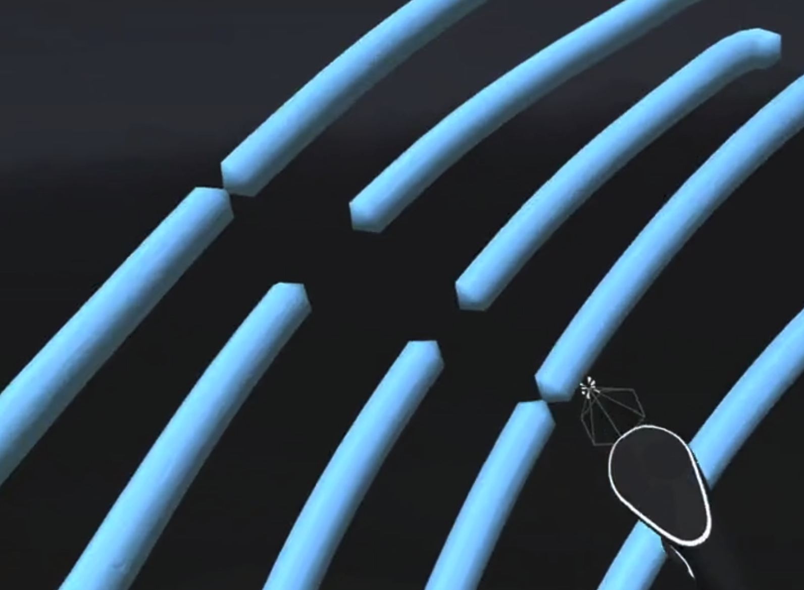

# Feature: Snip Tool

#### <mark style="color:red;background-color:red;">**THIS BRANCH HAS BEEN RELEASED AND IS PART OF THE REGULAR VERSION OF OPEN BRUSH**</mark>

#### Status: Released in [v2.0](../../release-history/v2.0-xr-update.md)

### What does it do?



It allows you to cut strokes so they behave as if they were separate strokes.
