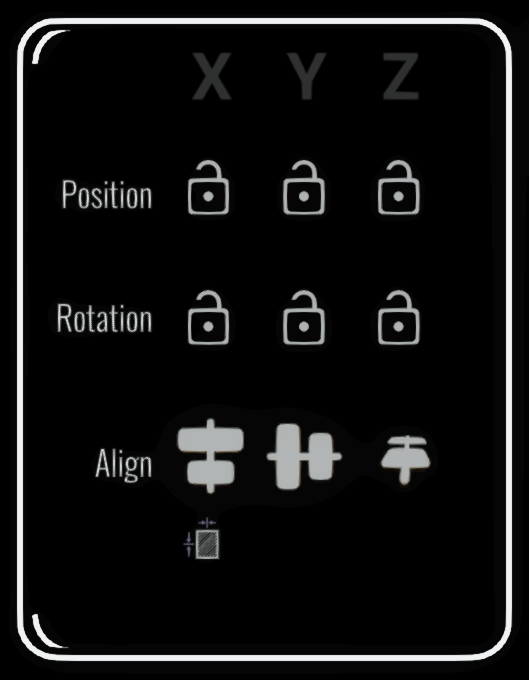

# Feature: Transform Panel and Snap Enhancements

#### <mark style="color:red;background-color:red;">**THIS BRANCH HAS BEEN RELEASED AND IS PART OF THE REGULAR VERSION OF OPEN BRUSH**</mark>

#### Status: Released in [v2.4](../../release-history/v2.4-prismatic.md)

<figure><figcaption></figcaption></figure> <figure><figcaption></figcaption></figure>

### What does it do?

A new panel allows for precise position/rotation/scale changes to brush strokes and imported objects.

1. Enter an exact value to change the position, rotation or scale of the current selection
2. Lock any axis so you can only move the selection along a line or in a plane
3. Lock rotation axes in a similar fashion.
4. Control which axes respond to the snap grid
5. Align all the objects or brush strokes you've selected in various ways
6. Distribute all the objects or brush strokes you've selected so they are spaced evenly.

We've improved the Snap Settings panel:

1. You can turn position and rotation snapping on or off for each axis independently
2. You can also snap all the currently selected objects
3. You can turn on or off the ability to snap the selected objects to guides

### What's it good for?

Creating regular arrangements of strokes or precisely positioning/orientating parts of your sketch.

### How do I install it?

This is now part of the regular release of Open Brush

### Where do I find the new Transform Panel?

It should appear automatically.

## How do I get help

Come over to the Open Brush Discord: [https://discord.openbrush.app](https://discord.openbrush.app) and chat to me ( andybak#5425 ).

I'm on UK time but I check in fairly regularly.
