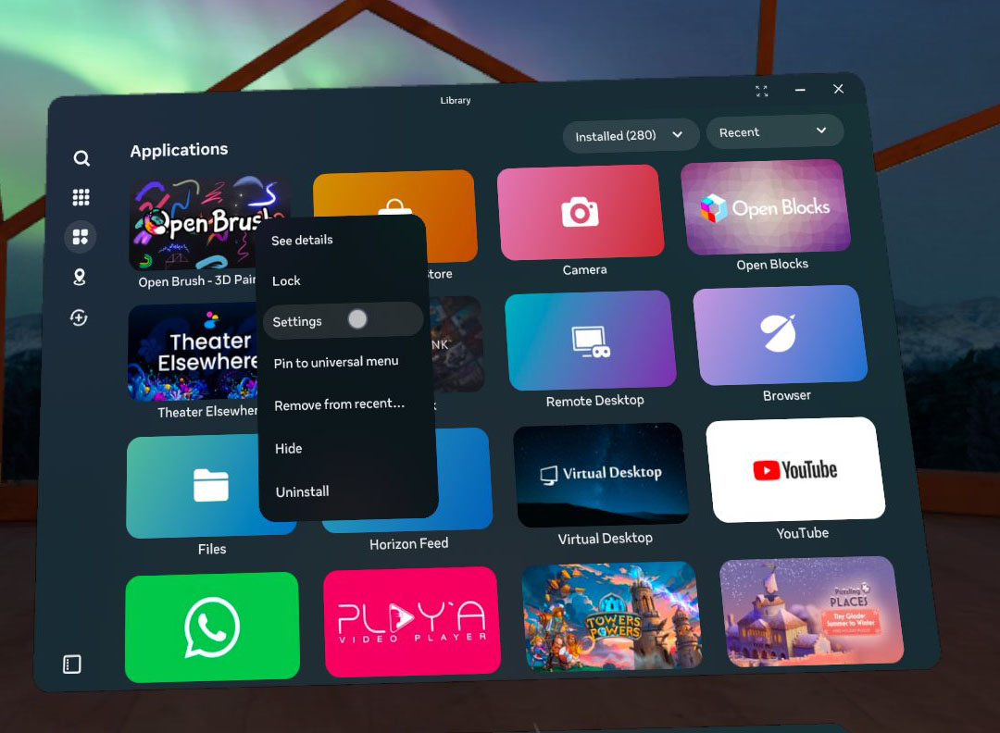
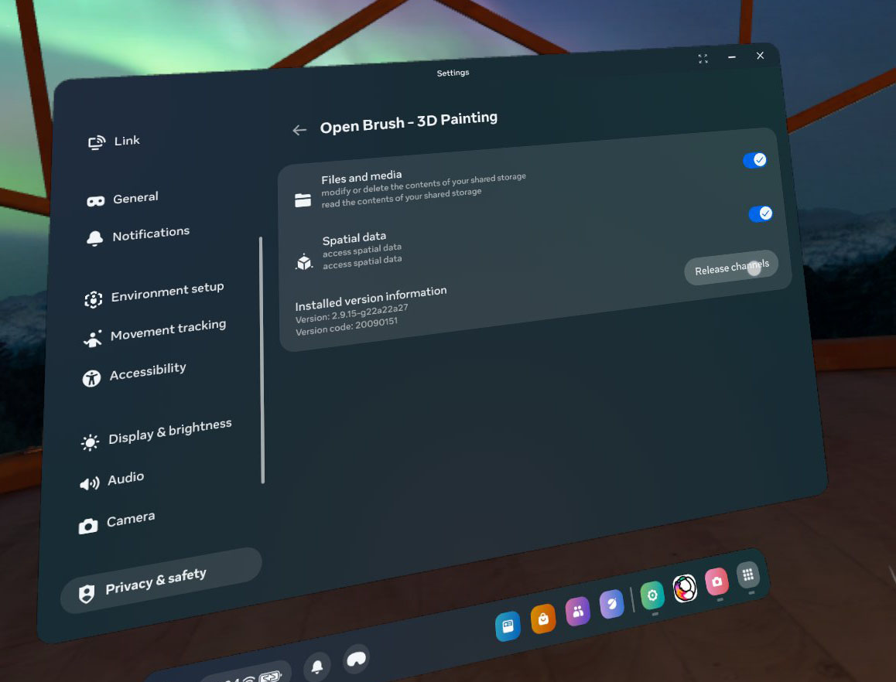
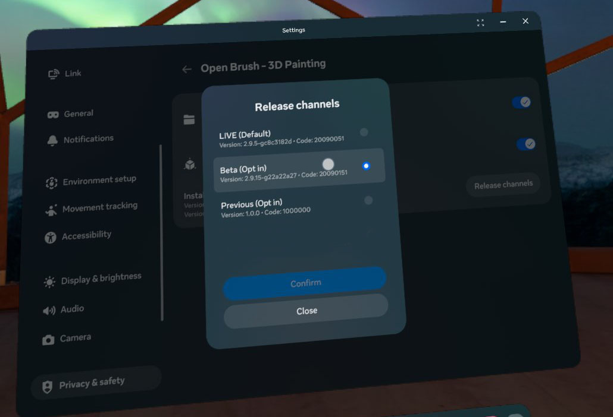

# Installing the Beta Release

This build is the pre-release version of Open Brush and may contain untested new features.


[automatic-changelog-1.md](../release-history/automatic-changelog-1.md)



Remember, these pre-release builds are labelled beta for a reason, and some features may contain bugs. Make sure to back up your important sketches before proceeding!


## Opting in to the Steam beta 

1. Right Click on Open Brush in your Steam Library and choose "Properties"

 (1) (1) (1) (1) (1).png>)

2\. Choose "Betas" on the left, and in the dropdown, select whether you want to opt into the beta or [experimental mode](main-experimental-build.md) version. You can also return to the normal release version by choosing "None"

<figure><figcaption></figcaption></figure>

3. Wait for Open Brush to update.

## Opting in to the Meta beta (Quest or PC) 

### In the headset (Quest)

1. Find Open Brush in your Library, click the 3 dots menu and choose "Settings"

<figure><figcaption></figcaption></figure>

2. Click "Release Channels"

<figure><figcaption></figcaption></figure>

3. Choose "Beta"

<figure><figcaption></figcaption></figure>

4. Wait for Open Brush to appear in your list of updates and choose "Update"

### Using the desktop app or website (Quest or PC)

 (1) (1).png>)

2. Or find Open Brush in the mobile app:

 (1) (1) (1).png>)

3. Choose "Beta". (Or you can switch back to "LIVE" if you want to go back to the normal release version. Note: If LIVE has a lower release number than Beta, you'll need to uninstall Open Brush first before downloading the LIVE version again.)
4. Wait for Open Brush to update.

## Download from Itch.io

We also host some beta versions on our Itch.io page.



## Download Directly from Github

If you can't find a version to suit your platform anywhere else then this page on Github has the latest beta build for all the platforms we support.


