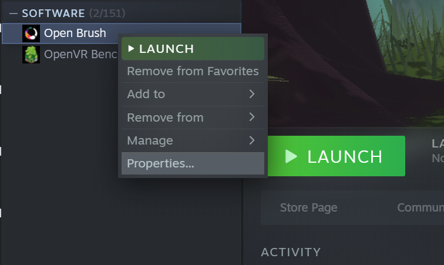
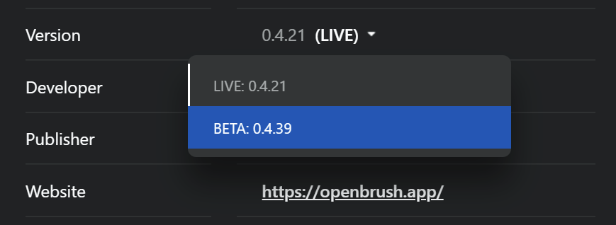
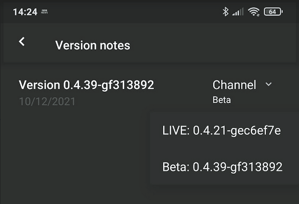

# Join the Open Brush Beta

The beta is where we try out the next version of Open Brush before it moves to the normal release channel. If you have time to use it and tell us what you find, your feedback helps us decide what needs fixing and what is ready to release.

You do not need to write a long report. A short description of what you were doing, what happened, and which platform you were using is useful.

You can see what changed in the [current beta release notes](../release-history/automatic-changelog.md).

Choose your platform below to get started.

## Choose your installation method

| Platform | Recommended method |
| --- | --- |
| Steam on PC or Steam Frame | Opt in through Steam **Properties → Betas** |
| Quest or Meta PC app | Select the **Beta** release channel |
| Windows or Quest sideload | Download a build from [Itch.io](https://openbrush.itch.io/openbrush) or [GitHub Releases](https://github.com/icosa-foundation/open-brush/releases/) |

## Steam: opt in to the beta

1. Open your Steam Library.
2. Right-click **Open Brush** and choose **Properties**.

   

3. Select **Betas** in the left sidebar.
4. In the dropdown, choose **beta**. You can also choose [experimental mode](main-experimental-build.md), or choose **None** to return to the normal release.
5. Close the Properties window and wait for Steam to finish updating Open Brush.

## Meta: opt in to the beta

This section applies to Open Brush on Quest and the Meta PC app.

### From a Quest headset

1. Find **Open Brush** in your Library.
2. Open the **⋯** menu and choose **Settings**.
3. Select **Release Channels**.
4. Choose **Beta**.
5. Return to your Library, wait for Open Brush to show an update, and select **Update**.

### From the Meta website or desktop app

1. Open the Open Brush product page in the Meta Store or Meta desktop app.

   

2. Open the release-channel selector. In the mobile app, you can find Open Brush from your Library or by searching for it:

   

3. Select **Beta**.
4. Wait for Open Brush to update.

To return to the normal release, select **LIVE** instead. If LIVE has a lower release number than Beta, Meta may require you to uninstall Open Brush before downloading LIVE again.

## Download a standalone beta build

Use one of these options when you are not installing through Steam or the Meta release channel.

### Itch.io

The [Open Brush Itch.io page](https://openbrush.itch.io/openbrush) hosts selected beta downloads and other standalone builds. Download the package for your platform, then follow the installation instructions included with that package.

### GitHub Releases

The [Open Brush GitHub Releases page](https://github.com/icosa-foundation/open-brush/releases/) contains the automatically generated beta builds for the platforms we support.

1. Open the newest release that is not marked as a normal `.0` release.
2. Expand **Assets**.
3. Download the package for your platform.
4. Follow the package's included instructions. Quest APKs are sideloaded rather than installed through the Meta Store.

## Tell us what you find

The best place to give feedback is the [Open Brush Discord](https://discord.openbrush.app). You can post there if you find a bug, have a suggestion, or simply want to tell us how a new feature feels to use.

Steam Discussions, social media, GitHub, and any other channel where you normally find us are fine too. Wherever you post, include:

1. The platform and headset you were using.
2. The beta version number.
3. What you were trying to do.
4. What happened, and what you expected to happen instead.

Suggestions, and reports of things that work well, are useful too. They help us understand which changes are ready to keep.

## Returning to the normal release

1. Steam: return to **Properties → Betas** and choose **None**.
2. Meta: return to the release-channel selector and choose **LIVE**.
3. Standalone builds: uninstall the beta package, then install the normal release from your usual store or download page.
