# Example Symmetry Plugins

### AlongStroke

<figure><figcaption></figcaption></figure>

The previous stroke you drew is used as a template and multiple copies of the pointer are spread along it as you draw

#### Parameters

* **Point Spacing:** The distance to space out the copies along the stroke

### AutoLathe

<figure>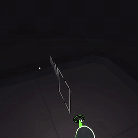<figcaption></figcaption></figure>

Like spinning the mirror by hand but with precise control

#### Parameters

* **Speed:** How fast to spin
* **Angle X:** The axis tilt in the X direction
* **Angle Y:** The axis tilt in the Y direction

### Boids

A flock of pointers follows your hand using simple rules to control how they fly

<figure>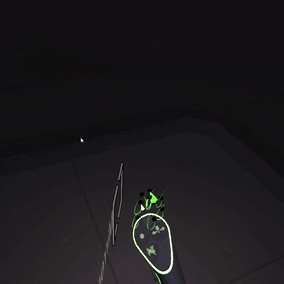<figcaption></figcaption></figure>

#### Parameters

* **Number of copies:** How many boids in the flock
* **Separation Amount:** How strongly each boid tries to stay away from others
* **Alignment Amount:** How closely the boids try and follow the flocks path
* **Pointer Attraction:** How strongly each boid is attracted to your brush position

### Ducklings



The pointers follow your brush position but each one moves towards a point where your hand was further back in time

#### Parameters

* **Copies:** The number of strokes to draw at once
* **Delay per copy:** How far back in time (in frames) for each copy
* **Amount:** How far between the current and past position to move towards. 0.5 is the midpoint between past and current

### EllipseAround



Copies of your stroke forming an ellipse - with optional color shifts

#### Parameters

* **Copies:** The number of strokes to draw at once
* **Eccentricity:** How elliptical the shape is
* **Axis Consistency:** Controls how much the elliptical axis follows your brush position

### Frame

<figure>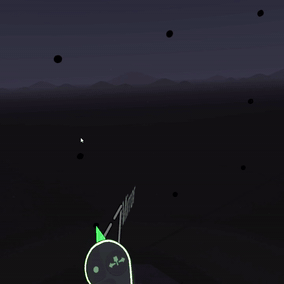<figcaption></figcaption></figure>

A simple frame of points following your brush position

### HoldFirstClick



Like [Many Around](example-symmetry-plugins.md#manyaround) except the widget always moves to where you start drawing

#### Parameters

* **Copies:** The number of strokes to draw at once

### ManyAlong

<figure>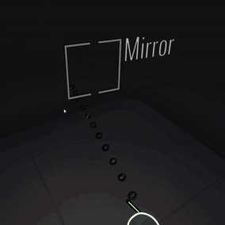<figcaption></figcaption></figure>

Linear copies of your stroke with optional color shifts

#### Parameters

* **Copies:** The number of strokes to draw at once
* **Distance:** How far each copy is from the next

### ManyAround

<figure>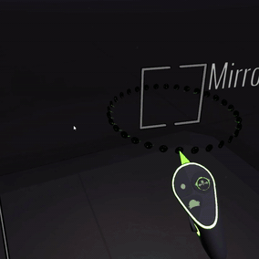<figcaption></figcaption></figure>

Radial copies of your stroke with optional color shifts

#### Parameters

* **Copies:** The number of strokes to draw at once

### MultiLathe

<figure>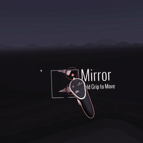<figcaption></figcaption></figure>

Autolathe but with multiple lathes.

#### Parameters

* **Speed:** The speed the lathe is spinning
* **Angle X:** The axis tilt in the X direction
* **Angle Y:** The axis tilt in the Y direction

### OmniLathe

<figure>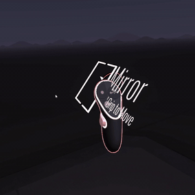<figcaption></figcaption></figure>

Like [Autolathe ](example-symmetry-plugins.md#autolathe)but you can vary the axis orientation

#### Parameters

* **Speed X:** How fast to spin the X axis
* **Speed Y:** How fast to spin the Y axis

### Pole



Multiple copies of your brush spaced between your left and right hand positions

#### Parameters

* **Copies:** The number of strokes to draw at once

### PolygonAround

<figure>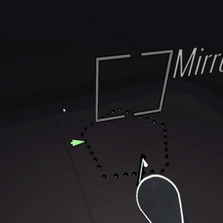<figcaption></figcaption></figure>

Copies of your stroke forming an polygon

#### Parameters

* **Copies:** The number of strokes to draw at once
* **Sides:** The number of sides of the polygon

### RectangleAround

<figure>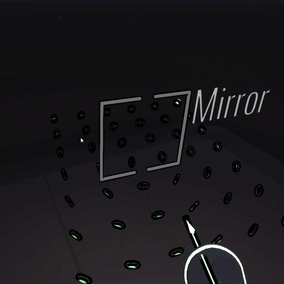<figcaption></figcaption></figure>

Copies of your stroke forming an rectangle

#### Parameters

* **Number of points along width:** How many points along the sides
* **Number of points along height:** How many points along the top and bottom
* **Spacing:** The distance between each point
* **Exterior Only:** Whether to create copies just around the perimeter or also fill in the middle

### Spin

<figure>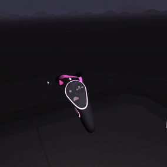<figcaption></figcaption></figure>

Multiple copies of your brush spinning around your actual brush position

#### Parameters

* **Copies:** The number of strokes to draw at once
* **Speed:** How fast the extra pointers are rotating
* **Radius:** The radius of the circle they are rotating around

### SuperEllipseAround

<figure>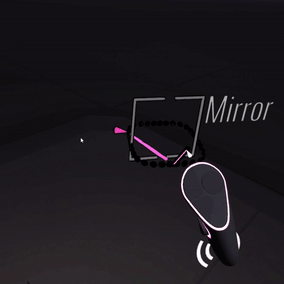<figcaption></figcaption></figure>

Copies of your stroke forming a [superellipse](https://en.wikipedia.org/wiki/Superellipse)

#### Parameters

* **Copies:** The number of strokes to draw at once
* **n:** The parameter that controls the overall shape of the superellipse
* **Eccentricity:** How elliptical to make the shape
* **Axis Consistency:** Controls how much the elliptical axis follows your brush position

### Svg

<figure>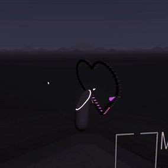<figcaption></figcaption></figure>

An example of using an SVG file as a template for symmetry patterns

### SvgAround

<figure>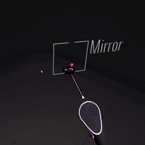<figcaption></figcaption></figure>

Similar to [SVG](example-symmetry-plugins.md#svg) but centered around the Symmetry Widget

#### Parameters

* **Point Spacing:** The distance between each pointer around the shape

### ~~ToGuide~~

_(Currently removed while I fix a bug)_

A line of copies between a guide and the symmetry widget

#### Parameters

* **Copies:** The number of strokes to draw at once

### TooManyAround

<figure>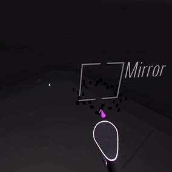<figcaption></figcaption></figure>

Based on [Many Around](example-symmetry-plugins.md#manyaround) - this was originally a bug but I liked it so here it is.

#### Parameters

* **Copies:** The number of strokes to draw at once

###
