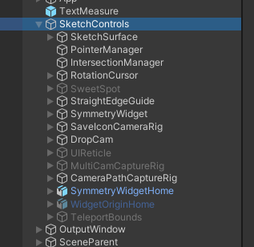
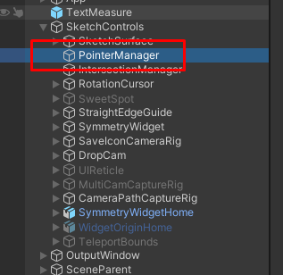
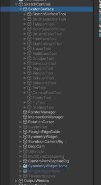
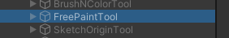
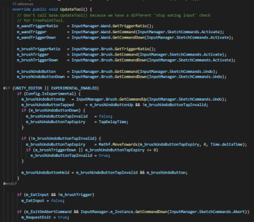

# Developer Notes

## Developer Resources

**Tutorials and Write ups for Modifying Tilt Brush:**

* [Customizing Tilt Brush - Part One: Introduction and Custom Brushes](https://lachlansleight.medium.com/customizing-tilt-brush-6e9a63bd5425)
* [Customising Tilt Brush - Part Two: Adding Flight](https://lachlansleight.medium.com/customizing-tilt-brush-3407f5ceb4ea) (nb the "Flight" feature itself is now included in the main release but the tutorial is still useful as a guide for adding your own features)
* [Scobot - How I change the look of Tilt Brush brushes in Unity3D](https://www.youtube.com/watch?v=38LSpe-2eIU)

## Open Brush Developer Documentation

**Spreadsheets with some useful info:**

* [Open Brush: Brushes, Materials and Shaders](https://docs.google.com/spreadsheets/d/12fHPnMNhpGGdR1mzFeCjXbg1Nv1PO1LZGcHwgp3S1Og/edit#gid=0)
* [Open Brush: Panels, Popups and UI Classes](https://docs.google.com/spreadsheets/d/1G0drrmswg4rs46wUQ2iDw\_vP8sLEy99p-CXyDTihCiE/edit#gid=1192181253)
* [Open Brush: Keyboard Controls and VR Input](https://docs.google.com/spreadsheets/d/1D7vIerfSz1vtyDS\_dPdvHiANluEr60VFrxhzE7ZbfAU/edit#gid=1073965238)

## Developing and Testing Without a VR Headset

It’s often quicker while developing to avoid jumping in and out of VR. [Monoscopic mode](../user-guide/monoscopic-mode.md#activating-monoscopic-mode) is very useful for this.

1.  Under "Flags" set EnableMonoscopicMode to true in your [Open Brush Config file](../user-guide/the-open-brush-config-file.md)

    ```
    "Flags": {
        "EnableMonoscopicMode": true
    }
    ```
2. Sometimes panels are placed over other panels. To move a panel hold shift at the same time as holding Alt to rotate the viewpoint (see below)

Entering play mode should now allow you to draw and control the app using the mouse and keyboard.

You can learn more about using [Open Brush without a headset](../user-guide/monoscopic-mode.md)

## Enums

### How to safely add new items to existing enums

**Important note:** Unity serializes enums as ints. Therefore if you change the order of enums then any scene or asset with a reference to them will suddenly point at the wrong entry.

This is especially a problem when merging branches. If you’re working on a feature that you will eventually want to merge with another branch you want to ensure that your enum values don’t change when the files are merged.

The best way to do this is to explicitly number your enums

```
public enum FoobarType
{
   ExistingValueA,
   ExistingValueB,
   ...
   MyNewValueA = 5000
   MyNewValueB = 5001
}
```

Now the only problem is to ensure you use numbers that other branches haven’t already used. We’ve settled on a simple low tech solution for now. Just go to this Google Sheet and reserve a block of 1000[: **Open Brush enum reservations**](https://docs.google.com/spreadsheets/d/17OOrxFgrA8COwxAinj9e7r2zwcKxLP4J306c5woZooc/edit?usp=drive\_web\&ouid=105817942650117193176)\*\*\*\*

### **Important Enums**

* **SketchControlsScript.GlobalCommands:** Commands are actions that (usually) record Undo state.
* **BasePanel.PanelType:** Panels are the persistent UI elements (as opposed to popups which tend to be transitory)
* **BaseTool.ToolType:** “Tools” are usually modal states that determine what actions happen when you use the controls on your main controller (the “brush” controller)
* **PointerManager.SymmetryMode:** The only symmetry mode enabled by default is the normal mirror. But there is a double mirror hidden behind the experimental flag and a “debug” symmetry mode that can only be enabled via code.

## Adding a New Panel

1. Add an entry to **BasePanel.PanelType** (see the note above about enums clashing)
2. If you think you’ll need custom functionality in the Panel class itself then create a new class inheriting from BasePanel:

```
public class MyNewPanel : BasePanel
{
}
```

Otherwise you can just use BasePanel directly in the next step.

1. It's easiest to copy an existing panel prefab (from Prefabs\Panels). If it's using a subclass of BasePanel different to yours, then change the script type for the panel (neat trick to swap scripts on existing components here: [https://answers.unity.com/questions/1125244/what-happened-to-conveniently-replacing-component.html](https://answers.unity.com/questions/1125244/what-happened-to-conveniently-replacing-component.html) )
2. Ensure your component’s PanelType is set to the value you added to BasePanel.PanelType
3. Change the Panel Description field for your new panel to something relevant.
4. In the main scene under SketchControls add an entry to the Panel Map (on the Panel Manager component). Choose the same PanelType as before. (note that the list item will have the wrong panel - or just a number - next to it if you used your own explicit enum value. This doesn’t seem to matter)

**Opening the new Panel:**

Either:

1. Add a button to an existing panel. The button should use the PanelButton component (or copy an existing one) or...
2. Tick “Begin Fixed” on the new panel component itself.

Question - what controls how close a panel is allowed to get to another panel on the wand?

Answer - BasePanel.m\_WandAttachHalfHeight

## Popups

Panels script components have a m\_PanelPopUpMap property which connects a GlobalCommand to a popup prefab. Having to add a GlobalCommand for every popup type is a bit tedious. I need to figure out how to open a popup without needing a GlobalCommand

1. Create a subclass of PopUpWindow if you need one (or just use OptionsPopUpWindow)
2. Copy the structure of an existing popup prefab substituting your popupwindow class
3. Add a button to a panel to open your popup. It should be an OptionButton or a subclass thereof.
4. Add a command to the GlobalCommand enum to handle opening your popup
5. The OptionButton should have it’s command set to the new command
6. Tick “requires popup” on the buttonscript
7. Edit the m\_PanelPopUpMap property on the panel prefab root that references the command and the popup prefab

### Passing Parameters to Popups

**CreatePopup** calls **SetPopupCommandParameters** on the popup and passes in iCommandParam and iCommandParam2 (usually from the OptionButton used to open the popup). So override this method to handle the parameters how you want.

See the **MenuPopUpWindow** subclass for an example.&#x20;

## Sliders

1. Create a class that inherits from BaseSlider
2. Go to BackdropPanel prefab and copy FogDensitySlider
3. Paste into the panel prefab you want to use it in
4. Change FogDensitySlider to use the class you created in #1(use method found at minute 18 here Found here ([https://youtu.be/HjsLzyNNxuM](https://youtu.be/HjsLzyNNxuM))
5. Create a custom command for editing the value the slider represents. See ModifyFogCommand for an example.
6. Use your new command to change the underlying value that the slider represents. This is typically done in OnPositionSliderNobUpdate and EndModifyCommand.
7. Test and make sure your slider correctly changes the underlying value
8. Register for events that get triggered if some other piece of code modifies your underlying value. In this case, we need to know about it so that we can update where the slider tick is located. If the event does not already exist, you may have to create a new event. One possible appropriate place is in Switchboard.cs

## Guides

These are typically known as "stencils" in code but prefab names may still use the term "guide".

Key Classes involved

* StencilWidget -> GrabWidget
* WidgetManager
* SketchControlScript

Creating a new Stencil / Guide

1. Make a copy of one of the stencil prefabs and rename it for your shape. The sphere is the easiest to work with in many cases.
2. Add your shape name to the end of the StencilType Enum in WidgetManager.cs. You may need to follow the recommendations about [Enums](../).
3. Add your prefab and shape type (Enum) to the WidgetManager Stencil Map in the inspector.
4. Make a duplicate of the stencil script you used in #1 and rename it myNameStencil.cs
5. Replace the stencil script on your prefab to use the one you just created.
6. Open the GuideToolsPanel in Assets/Prefabs/Panels, duplicate one of the buttons and position it appropriately in the panel.
7. In the StencilButton component change the Description Text and Button Texture to something appropriate for your shape and change the type to your stencil type.

Question: What determines the distance at which the pointer will snap to the guide?

Answer: WidgetManager.m\_StencilAttractDist. The code does this in\
WidgetManager.**MagnetizeToStencils**.

Question: How do you enable a stencil to be scaled non-uniformly (i.e. along a particular axis)?

Answer: See SketchControlScript.**UpdateGrab\_ContinuesTwoHands** and implement **GetScaleAxis** and **RecordAndApplyScaleToAxis**.

## Button Scripts

(Also see [Open Brush: Panels, Popups and UI Classes](https://docs.google.com/spreadsheets/d/1G0drrmswg4rs46wUQ2iDw\_vP8sLEy99p-CXyDTihCiE))

* **ActionButton :** BaseButton\
  Triggers a UnityEvent assigned in the inspector.
*   **ActionToggleButton :** ActionButton

    Triggers a UnityEvent and maintains on/off state
*   **ConfirmationButton :** BaseButton

    Used in popups. Calls ResolveDelayedButtonCommand on the parent panel and sends true/false depending on the property set in the inspector
*   **LongPressButton :** OptionButton

    OptionButton that opens a popup when long pressed.
*   **LongPressToolButton :** LongPressButton

    (not used) Extends LongPressButton and adds tool activation
*   **ModeButton :** BaseButton

    Not used directly but is the base class for Gallery PolySet and Reference buttons
*   **MultistateButton :** BaseButton

    Cycle through multiple states on each click. Calls a GlobalCommand with the index of the current option
*   **NavButton :** BaseButton

    Navigates between pages in paged panels and popups.
*   **OptionButton :** BaseButton

    Optionally calls a GlobalCommands and passes in two parameters assigned in the inspector. Optionally opens a popup set via the PopupMap on the parent Panel script. \
    Optionally toggles between two states.
*   **PanelButton :** BaseButton

    Toggles visibility of a panel (BasePanel.PanelType)
*   **PropertyToggleButton :** BaseButton

    Allows the button to be connected to a bool property on a component, and automatically reflect its value as well as toggling its value when the button in pressed.
*   **Layers.ToggleButton :** BaseButton

    Performs no action but maintains on/off state
*   **ToggleButton :** OptionButton

    Invokes a UnityAction and also maintains on/off state.
*   **ToolAndPanelButton :** BaseButton

    Combines ToolButton and PanelButton functionality
*   **ToolButton :** BaseButton

    Activates a tool (BaseTool.ToolType)

## Pointers and the Input System

By @moat

For the input system there's this one scene Gameobject called a SketchControls:



This whole chungus of a gameobject sits in the scene and it's got like, nearly every bit of UI and management and widgety stuff.

It's like the player is already instantiated within the game to start with when you load the Main scene. There's a gameobject called the PointerManager:



This thing manages up to 10 cursors at once (although it can be set to handle more):


Brushes are attached to cursors, and when you do anything with your controllers, it drives the Main Pointer Prefab.

The reason they have multiple cursors is for things like multibrushes that make multiple brushstrokes appear simultaneously when you drag out a stroke

Pretty much every tool you switch between is sitting on a script within one of these gameobjects parented to SketchSurface:



When you switch tools, it activates one of these objects and deactivates the others

Much of the magic occurs within the FreePaintTool



It's the star of the show, being the thing that makes happy little trees appear and happy little clouds.

What most tools have in common is UpdateTool()


This is like their main interaction loop. At the start, the inputmanager states are captured into variables to be used throughout the rest of the update loop:



(rather than re-calling the same inputmanager functions again and again and again)

The Wand is your non-dominant hand, the Brush is your dominant hand controller and performing the controller-tap gesture (lightly tapping the handles together) will swap these controllers.

This BrushTrigger bit handles the actual trigger press:


m\_brushTrigger is just a boolean that becomes TRUE when the trigger is pressed beyond the threshold while the BrushTriggerDown variable becomes true only during the update tic when the trigger has been pressed and brushTriggerRatio is a value mapped from 0->1 depending on how far that analog trigger has been pulled.

## The Model Import UI

ReferencePanel.cs is the media library script.

LocalModelButton has got a method RequestModelPreloadInternal but it isn’t called on the local media panel - only on the Poly panel. If we want to make local media behave more like the the Poly panel then we should go through PolyPanel RefreshPage to understand what it's doing and take the relevant parts and add them to ModelPanel RefreshPage.

## Importing 3d models

The code that does the actual work is in models.cs. A typical call stack goes:

```
RequestModelPreloadInternal (LocalModelButton.cs)
  LoadFullyCoroutine (models.cs)
    LoadModel (models.cs) 
      CreatePrefab (models.cs)
```

This presupposes you’ve instantiated model class. An example instantiation might look something like:

```
var model= new Model(Model.Location.File(path));
```

Once you have a valid model you need to spawn it into the scene. Look at SpawnValidModel in ModelButton.cs

Example code to synchronously load a model:

```
public void TestImport(string filename, Vector3 position, Quaternion rotation)
{
    path = Path.Combine(App.MediaLibraryPath(), "Models", path);
    var model = new Model(Model.Location.File(path));
    model.LoadModel();

    var tr = new TrTransform();
    tr.translation = position;
    tr.rotation = rotation;
    CreateWidgetCommand createCommand = new CreateWidgetCommand(
    WidgetManager.m_Instance.ModelWidgetPrefab, tr);
    SketchMemoryScript.m_Instance.PerformAndRecordCommand(createCommand);
    ModelWidget modelWidget = createCommand.Widget as ModelWidget;
    modelWidget.Model = model;
    modelWidget.Show(true);
    createCommand.SetWidgetCost(modelWidget.GetTiltMeterCost());

    WidgetManager.m_Instance.WidgetsDormant = false;
    SketchControlsScript.m_Instance.EatGazeObjectInput();
    SelectionManager.m_Instance.RemoveFromSelection(false);
}
```

Note - only tested on local models. The filename is appended to Media Library/models

## Export formats

Currently several formats are hidden behind ifdefs for various platform flags and the experimental flag. The logic is a bit tortuous so here’s a pseudocode version:

```
if App.PlatformConfig.EnableExportJson:
    "json"

#if FBX_SUPPORTED:
    if App.PlatformConfig.EnableExportFbx:
        "fbx"

#if USD_SUPPORTED:
    if App.PlatformConfig.EnableExportUsd:
        "usd"

#if (UNITY_EDITOR || EXPERIMENTAL_ENABLED):
    if Config.IsExperimental:
        "wrl"
        "stl"
        #if FBX_SUPPORTED:
            "obj"

if App.PlatformConfig.EnableExportGlb:
    "glb"
```

If you want to add a new export format then add your script to Scripts/Export and modify the big set of if statements in ExportScene in Exports.cs. You’ll also want to add a pair of progress.SetWork and progress.CompleteWork calls to update the progress UI.

## How Exports Group Strokes

Currently strokes are grouped by brush type when exported to other formats. People have asked in the past to also group by color AND brush type. @1pld offered the following solution:

> You need to convince Open Brush to split things out by color as well as by brush. It's not that tricky a change if you can modify the code (or can get someone to modify it for you). This compiles but I haven't tested it
>
> ```
> diff --git a/Assets/Scripts/Export/ExportCollector.cs b/Assets/Scripts/Export/ExportCollector.cs
> index c9df745..5b1e27f 100644
> --- a/Assets/Scripts/Export/ExportCollector.cs
> +++ b/Assets/Scripts/Export/ExportCollector.cs
> @@ -251,6 +251,13 @@ class ExportCollector {
>  
>          string legacyUniqueName = $"{desc.m_DurableName}_{desc.m_Guid}_{group.id}_i{batchIndex}";
>          string friendlyGeometryName = $"brush_{desc.m_DurableName}_g{group.id}_b{batchIndex}";
> +        // If it's split by color then we have to append some kind of thing to keep the unique name unique
> +        if (brush.m_color is Color c) {
> +          Color32 c32 = (Color32)c;
> +          string cstr = $"_c{c.r:2X}{c.g:2X}{c.b:2X}";
> +          legacyUniqueName += cstr;
> +          friendlyGeometryName += cstr;
> +        }
>  
>          UnityEngine.Profiling.Profiler.BeginSample("ConvertToMetersAndChangeBasis");
>          ExportUtils.ConvertUnitsAndChangeBasis(geometry, payload);
> ```
>
> And also
>
> ```
> diff --git a/Assets/Scripts/Export/ExportUtils.cs b/Assets/Scripts/Export/ExportUtils.cs
> index 935411f..486a3a2 100644
> --- a/Assets/Scripts/Export/ExportUtils.cs
> +++ b/Assets/Scripts/Export/ExportUtils.cs
> @@ -76,7 +76,7 @@ public static class ExportUtils {
>      }
>  
>      public IEnumerable<ExportBrush> SplitByBrush() {
> -      return m_strokes.GroupBy(stroke => stroke.m_BrushGuid)
> +      return m_strokes.GroupBy(stroke => (stroke.m_BrushGuid, stroke.m_Color))
>            .Select(g => new ExportBrush(g));
>      }
>    }
> @@ -85,6 +85,7 @@ public static class ExportUtils {
>    /// This is the only grouping that can be converted to geometry
>    public class ExportBrush {
>      public BrushDescriptor m_desc;
> +    public Color? m_color;
>      private List<Stroke> m_strokes;
>  
>      public ExportBrush(IGrouping<Guid, Stroke> group) {
> @@ -92,6 +93,12 @@ public static class ExportUtils {
>        m_strokes = group.ToList();
>      }
>  
> +    public ExportBrush(IGrouping<(Guid guid, Color color), Stroke> group) {
> +      m_desc = BrushCatalog.m_Instance.GetBrush(group.Key.guid);
> +      m_color = group.Key.color;
> +      m_strokes = group.ToList();
> +    }
> +
>      public struct PoolAndStrokes {
>        public GeometryPool pool;
>        public List<Stroke> strokes;
> ```

Taken from the following comment: [https://discord.com/channels/783806589991780412/806934697237938216/820958273032683520](https://discord.com/channels/783806589991780412/806934697237938216/820958273032683520)

## Procedural Strokes

By @andybak

I've written code to procedurally generate strokes in two places with some subtle differences that prevents me from combining them into a single utility method just yet.

1. [Here in my API branch](https://github.com/IxxyXR/open-brush/blob/features/http-api/Assets/Scripts/API/DrawStrokes.cs#L58)
2. [Here in my symmetry branch](https://github.com/IxxyXR/open-brush/blob/features/symmetry/Assets/Polyhydra/Scripts/PolyhydraTool.cs#L130)

The gist of it all is basically:

1. Create an array of control points
2. Create a Stroke using those points
3. Call stroke.Recreate and pass in App.Scene.ActiveCanvas or similar
4. MemoryListAdd
5. PerformAndRecordCommand BrushStrokeCommand

That whole shebang seems necessary to ensure that undo and saving work correctly.

I think MemoryListAdd was needed for save/loading to work and PerformAndRecordCommand was needed for Undo… The sketch memory list is what gets saved into .tilt files for brush strokes. The undo stuff handles more than just brush strokes. The undo log knows about (most) user actions and what code to call to reverse/redo them.

Stroke.Recreate seems to create the batch object and mesh - but that's not enough for "real" brush strokes.

Recreate (eventually) calls FinalizeBatchedBrush on the correct BrushScript. These overridden methods are what actually does the mesh creation.

## Adding a New Tool

In Open Brush, almost everything we do is done with the help of tools. A tool can be something like the Straight Line tool, which applies a modifier to any new brushes created with the Free Paint tool, or it can be something like the Teleport tool, which moves the player. At the end of the day, a tool is simply a way for us to run some code in a nice compartmentalized way.

In essence they are usually modal states that determine what actions happen when you use the controls on your main controller (the “brush” controller).

(based on [Lachan's Tutorial](https://lachlansleight.medium.com/customizing-tilt-brush-3407f5ceb4ea) )

1. Open Assets/Prefabs/Panels folder. Find “AdvancedToolsPanel” and open it
2. (If you want to build for Quest, you’ll also need to perform the following operations on the “AdvancedToolsPanel\_Mobile” prefab)
3. Duplicate one of the other Tool buttons to create a new button. (Note that the mirror and straight edge buttons are not tool buttons)
4. Name your new button object “Button\_Foo”
5. Make sure that it’s right underneath the “Button\_Straightedge” object at the same level in the hierarchy.
6. Change the Description Text to read “Fly”
7. Make a 128x128 black and white image to use as the button texture. Place this image in the Assets/Resources/Icons folder and name it “foo.png”.
8. Drag it on to the “Button Texture” property of your new button object.
9. In Assets/Scripts/Tools/BaseTool.cs find the ToolType enum and add a new line to the bottom:

```
public class BaseTool : MonoBehaviour
{
 public enum ToolType
 {
   [...],
   FooTool
 }
```

1. Go back to our component and select “Foo Tool” as the tool type for our button. Save the prefab.
2. In the main scene find the object SketchSurface which is a child of SketchControls.
3. Add a new empty child to this object
4. Give it a scale of (0.5, 0.5, 0.5) and call it FooTool placing it just above the EmptyTool object.
5. Place all the visual content as children of an empty ‘DirectionIndicator’ object which is a child of our tool.
6. Deactivate the new tool
7. Create a new script in Assets/Scripts/Tools and call it FooTool.cs. Use the template script \[link]
8. Add this new component to our FlyTool object in the scene, ensure that that tool type is set to FooTool
9. In Assets/Scripts/InputManager.cs look for the SketchCommands enum. Add “Fly” at the bottom
10. Scroll down in InputManager to the GetCommand function. We need to pass the command through to the Brush
11. Update the function to look like this (note lines 37 and 38):
12. Find the Brush.GetCommand function in the file Assets/Scripts/Input/ControllerInfo.cs and update it (note lines 27 and 28)
13. Press play.

## Controller UI for Tools

(this section of the docs is a work in progress)

Places to look:

1. Controller Material Catalog component on the App object in the main scene (contains all the materials used for adding custom buttons to the controller model)
2.  AssignControllerMaterials method on BaseTool subclasses. This often calls methods on ControllerGeometry.cs which in turn typically does something like:&#x20;

    ```
    Materials.Assign(PadMesh, SelectPadTouched(active, Materials.ShareYt));
    ```

## Custom Stroke Data

**by @1pld**

For stroke/control point extension data, I'd propose adding a level of indirection (the solution for everything). If a .tilt appends data to strokes or points, it should come with some extra self-describing data in the .tilt. So rather than this:

```
 // Data blocks for StrokeExtension IDs in [0,15] are 4 bytes.
 // Data blocks for StrokeExtension IDs in [16,31] are uint32 length + <length> bytes.

  [Flags]
  public enum StrokeExtension : uint
  {
    MaskSingleWord = 0xffff,
    None = 0,
    Flags = 1 << 0,     // uint32, bitfield
    Scale = 1 << 1,     // float, 1.0 is nominal
    Group = 1 << 2,     // uint32, a value of 0 corresponds to SketchGroupTag.None so in that case,
                        // we don't save out the group.
    Seed = 1 << 3,      // int32; if not found then you get a random int.

    AudioStream = 1<<16, // wav-format audio to be piped into the shader for this stroke while it's playing back  <--- new
  }
```

you'd have something like "the stroke sets extension bit 16; the client looks in the sketch metadata to find out what stroke extension 16 is. It has a mime type / guid / whatever. The client determines it doesn't know what to do with that data so it throws it away, which it can because that data chunk is in length+data format" or "all stroke extensions 16 and above are now defined to be length + guid + \<length - sizeof(guid)> bytes. The client determines whether it understands the data based on the guid etc".

## The coordinate system

**by @1pld**

Re some comments I've seen elsewhere, it would be good to document the coordinate systems Tilt Brush uses and how they're reflected in the scene graph. Super quick notes on this:

* "room space" = the user's physical environment. some people call this "tracking space"
* "scene space" = the user's virtual environment -- the square panel on the ground, the mountains in the distance, etc.
* "canvas space" = the user's artwork. Typically there's just a single Canvas whose pose is the same as the Scene pose (it's a direct child of the scene, with identity localTransform). But when you have a selection or groups, those are additional Canvas instances

the root of unity's scene graph we call "global space" (we try to avoid the term "world space" in the code because "world" is ambiguous). "global space" == "room space". The Scene is a child in global space, and canvas is a child of scene

That is backwards from what some people expect, which is for "room space" to be a child of "virtual space".

\_CS, \_SS, \_GS, \_RS suffixes all denote those spaces.

## Paul Du Bois’s Thoughts on Procedural Strokes

I would look at the rebrush tool (the one that's like recolor, but changes brushes). That takes an existing set of control points and regenerates the geometry.

More specifically, take a look at Stroke.cs and the various functions in there like Recreate. The general idea is you should be able to dump a bunch of control points into a Stroke, call Recreate, and you've got geometry. The API hasn't gotten as simple as I'd like, you still have to worry a bit about the various intrusive linked lists that strokes get put into when you draw "normally" (or on load), but it shouldn't be too bad

The guts of that are how I'd do it if you want something up and running quickly -- it's a good demonstration of how to generate knot information, pipe it to the right place, get a proper stroke back out. See ParametricStrokeCreator.cs

ParentBrush might also be interesting to you... but it violates some assumptions and doesn't play nicely with save/load, undo/redo etc. There's some notes about how to move forward from that in the file

The playback code might be another entry point, if you want to make more than one stroke (i.e. fill a volume with strokes). You could boot up the playback system pretend you're loading a file (but instead, you're generating the control points programmatically) The playback system has a mode that is more "real time", where stroke timestamps are allowed to overlap, multiple strokes can draw in at once and will draw in at the speed they were painted, etc. Might have bitrotted a bit, but might be a useful entry point for understanding the drawing system

One kind of annoying thing that we never fixed is that there are only 4 (or maybe 8) global pointers, and everyone just kind of hardcodes the index of the one they want to use. So the 4-way mirror will use pointers 0-3, the load code assumes it can use any of them, etc. That's as opposed to people instantiating as many pointers as they need concurrent lines, doing stuff with them, throwing them away

Ideally you wouldn't need a "pointer" at all in order to draw lines. Anyway, something to watch out for if you want procedural stuff happening at the same time the user's painting.

The guide system could use a SDF based mode so guides could interact with each other, have smooth joins, etc; rather than you getting stuck to one at a time. Man, that would be great.

(Another time Paul said “Look at basebrushscript.cs and the method Stroke.Recreate” - the latter is mentioned above.)

## Open Questions

1. How to programmatically generate a mesh in such a way that it will correctly save and load back in a .tilt file?

_TB files only save references to meshes (eg, Poly asset ids, paths to imported fbx or obj files, etc). Currently the only way to put geometry in a tilt file is to add brush strokes to it._

1. How to modify meshes from either Blocks or Poly that are embedded in a sketch?

_Poly assets are immutable, so if a .tilt has a reference to a poly object, a tilt file that references it can guarantee that it will always look the same._

1. How to fix the undo/save behaviour of experimental brushes using “ParentBrush”?

_See the giant comment at the top of ParentBrush :) Consider ParentBrush proof-of-concept that needs a week-ish of design thinking and implementation work to turn into something ready for prime time_

1. How to add parameters to brushes. The sheer number of brushes might become too many and many brushes are simple variants of each other. A UI to allow brush parameters to define variants would help address this.
2. How to visualize/manipulate stroke knots?

_For the most part the knots aren’t that interesting; but in a pinch you could try taking a stroke, switching its brush to a spray brush (which lays down one quad per control point) and calling stroke.Recreate(). For bonus points you could create a SprayBrush variant that drops down little coordinate axes instead of quads._

1. How to see the console log in a live VR session?

## Global Transform Helper

By @1pld

If you have a global transform we have a helper: App.ActiveCanvas.AsCanvas\[your transform component] = your canvas-relative transform This works no matter where the transform component is in the hierarchy

## Other Discord Brain Dumps by @1pld

_(various nuggets extracted from drive-by comments that Paul made on the Discord)_

Knot is a control point with some more data glommed on; it's a term that geometrybrush invented

_Do you need to manually record strokes to memory after using DetachStroke?_

You do. The intent is that Recreate doesn't interact at all with "memory" (the two linked lists of strokes, ordered by time of first and time of last control poin t). Recreate, uncreate, etc only affect the stroke geometry. They take it from the state "no geo" to "with geo", or from "with geo" to "with different geo", but shouldn't interact with any higher-level considerations like memory

There may be assumptions that you're calling it on a stroke that's in the linked lists already, so maybe that explains some of the strange behavior you're seeing.. but if you want to memorize a stroke I'm almost certain you should do it yourself; don't count on recreate to do it for you

1pld

Historically, things started with QuadStripBrush, with a couple variants based on how UVs were generated. It just generates strips, 6 unique verts per tri (3 for top, 3 for bottom, backface culled). Then there was a variant that produced isolated quads (for brushes like "leaves") instead of strips. QuadStripBrush uses a class called MasterBrush to temporarily store and work on the geometry before it's finalized into a mesh / batch. Then I wrote GeometryBrush to "reboot" geometry generation and enable other kinds of topology. The intent was that QuadStripBrush-based brushes would migrate to FlatGeometryBrush, but the way that QuadStripBrush did its smoothing was not easy to replicate (the details aren't important but the incremental algorithm QSB uses means that each knot doesn't have "local support" in the technical sense, and GeometryBrush in part was written to force people to use knots with local or at least bounded support for efficiency reasons). So FlatGeometryBrush isn't used much. Most other brushes are derived from GeometryBrush. GeometryBrush is notable for using a different storage scheme for intermediate geometry called "GeometryPool". This is used all over the place, wherever we want to process mesh data in C# (eg: geometry generation, multiplying geometry by a TrTransform, export). Some of these manipulations have native-code versions that MachWerx wrote in C++; I think we ship that DLL in the repo. The GeometryBrush variant of the old "isolated quad" brushes is SprayBrush, and I think the old version of that doesn't exist in the code any more. GeniusParticlesBrush is I think Xap's very first work on the project and replaced an older less genius way of particle brushes. TubeBrush was our first volumetric brush; it's also slightly notable for using a different method of curve framing. Instead of BaseBrushScript.ComputeSurfaceFrameNew, it uses parallel transport Dark Jeremy wrote HullBrush and that made the concept of "Knot" kind of weird.

ParentBrush was an experiment That's the major ones

I don't work for Google any more, but I don't think any kind of wholesale export of the bug db would be allowed. Happy to expand on any TODOs that I still understand though

Backwards compatibility is a very real issue in the code; we took a very hard line and very seldom swapped in completely new implementations for a brush guid. Mostly when we wanted to fix or upgrade the behavior of brushes, we'd create an entirely new guid and leave the old one around for compat.

I think monoscopic mode is a prime area for improvement! A lot of people would benefit

Anything is possible, but the main reason I wrote abstractions like Stroke.Recreate and so on is because I found it hard to keep track of all the contortions with pointers, pointer managers, input, and so on :). I know I traced through the whole path from input to geometry many many times over the course of the project; it's useful to do. From memory I can sketch it out at a very high level: input comes in from a user, makes its way to a pointer. The pointer deals with creating/finalizing BaseBrushScript instances. The pointer also deals with remembering which control points were used. This is a little gross though; see UpdateLineFromObject. The pointer assumes that the BBS will use a piece of input, and it's up to the BBS to tell it "I used new input to over-write the last quad/whatever" or "I used your input to create an all-new quad", which has implications for which control points the pointer keeps around. Lots of potential for off-by-one errors and so on. Eventually the user lets go of the trigger, the PointerScript terminates the line, deals with off-by-one issues in its control point array, arranges for the geometry in the brush to be finalized into a GameObject/batch, for the control points to be finalized into a stroke, puts the stroke into the memory, and so on

Or we could be loading from a file, in which case the work is substantially similar. We reuse PointerScript to load from files and kind of trick it into thinking that it's being driven from a user; but there are hacks to ensure that the BaseBrushScript doesn't reject any control points coming in. And there are some other hacks to allow brushes to try to process a whole batch of control point input at once instead of one-at-a-time. This was one of the main motivations for GeometryBrush; a brush should 1. not do O(n) work for each new control point, and 2. be able to process a group of control points at once instead of doing O(n) updates

Updating "stretch" UVs is obviously always going to be O(n) so there are some other hacks to defer that generation until "update visuals" gets called. Maybe some other things. Anyway, there are mechanisms to prevent O(n^2) behavior on load. Similarly, you wouldn't want your hull brush to compute a hull N times when loading. Something to think about when writing a geometry generator.

The batch manager was written because "1 gameobject per stroke" is obvs not scalable. So it's a way of taking a bunch of tiny meshes, all of the same material, and grouping them into larger meshes. The tiny meshes become a "BatchSubset" within a larger mesh "Batch", and a single material ("BatchPool") will have multiple meshes ("Batches") and the whole thing is orchestrated by BatchManager

Some thoughts on @andybak 's comment about "let a thousand brushes bloom". Tilt Brush didn't have a well-defined notion of what should happen when loading a .tilt containing an unknown brush guid. It would warn about it, and end up ignoring the strokes using that brush (see: SaveLoadScript.GetForceSupersededBy which ignores the problem when loading from disk, and StrokePlayback.BaseInit for where that warning is eventually surfaced quite late in the load process, after a stroke creation has already failed). It got away with that because by construction (and by control of the ecosystem) that error was prevented for the most part. In this new ecosystem where "unknown brush" is going to be much more likely, regardless of the strategy chosen for blooming 1000 brushes, I think it's worthwhile replacing the current behavior with something a little more friendly to both producers and consumers of .tilt files. So a sketch of a proposal: - At a minimum, guarantee that loading then saving a .tilt containing an unknown brush preserves strokes using that brush - Embed some "fallback brush" data in the .tilt's brush index, so clients can at least show something reasonable. eg, if a client knows that the missing brush is a quadstrip, tube, spray (ie, disconnected quads), volume (ie, some kind of hull), particles, or "other", that's enough info to substitute in some generic-looking placeholder brush.

There could be a similar discussion around the forward-compatible extension points built into the per-stroke and per-control-point data. Currently there can only be 32 kinds of extension data (as opposed to basically infinite brushes), which doesn't seem like enough for an ecosystem. Plus, you'd need someone to control a registry to dole out pieces of that very tiny namespace. On the other hand, it's not like people are clamoring to add new kinds of data to strokes or control points (... yet)

andybakToday at 9:03 PM

So we do need some taxonomy for brush behaviour that can be relied on universally. i guess that could be based on historic baseline of brushes released before we went brush crazy.

1pldToday at 9:04 PM

Yeah, I think we have enough data to have a rough taxonomy; and if some .tilt used an unknown taxonomy for an unknown brush, a client could then choose to ignore it, or substitute in whatever they chose

My initial taxonomy would be: ribbon, tube, hull, spray, particles, and "do not substitute"

andybakToday at 9:11 PM

why not have the entire original brushset as potential fallbacks?

we could have the smaller taxonomy to help partial implementations - but any proper client app should at least support the original set of brushes that are already out there.

1pldToday at 9:17 PM

Totally; the fallback could be specified as a guid too. I thought that a higher-level approach might be easier for brush authors -- it's the difference between an extra kind-of-inscrutable guid field in the brush descriptor, vs a dropdown saying "brush type"
