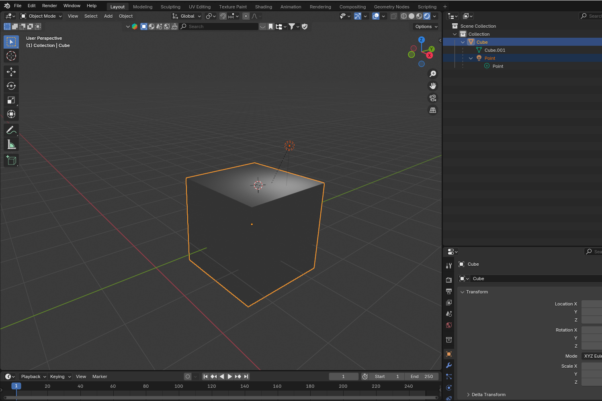

# UI Elements

## Panels

The main UI surfaces. Panels can be floating or docked to the wand. They contain buttons and sliders and can spawn popups.

## Popups

Popups are similar to panels but they are short-lived and usually close automatically after selecting an option

## Tools

Tools change the action the controller on your dominant performs. Examples are the Brush Tool for painting and the Selection Tool for selecting strokes and widgets.

Some tools have different modes. Modes can be activated in several ways:

* A button on a panel or in a tray
* Pressing the secondary button on the same controller that has the tool on it (your dominant hand
* using the thumbstick (or swiping on the Vive controller touchpad) to change between modes.

## Trays

An alternative to popups. Some tool buttons when active will reveal a "mini panel" to the right of the main panel containing further buttons

## Widgets

These are interactable objects within the scene. The simplest examples are imported images and 3d models which can be resized and moved. More complex widgets can contain UI elements of their own - for example, the camera path tool has widgets for each control point.&#x20;

### GrabWidget

This is the base widget that all other widgets inherit from.&#x20;

### ModelWidget

ModelWidget enables the user to grab and manipulate 3d models.

* A ModelWidget can be divided into smaller ModelWidgets if the model has parent-child relationships
  * see `./Assets/Scripts/Commands/BreakModelApartCommand.cs`
* ModelWidget has a property `private ObjModelScript m_ObjModelScript` for getting information about the model's meshes.
  * see this 100-line utility script `./Assets/Scripts/ObjModelScript.cs`
* The other data source for ModelWidget is `private Model m_Model` . It is used for e.g. getting the model's export name, and the model's transform hierarchy.
  * see `./Assets/Scripts/Model.cs`

Importing this car 3d model from Blender into Open Brush:

<figure><figcaption></figcaption></figure>

Results in this kind of GameObject hierarchy in Unity:

<figure><figcaption></figcaption></figure>

### LightWidget

This is the Widget for lights. We want to have a specific widget for lights so that we can have a `SceneLightGizmo`for each Light, which is a visual light helper for the user. (other reasons exist too)

* 2 ways the user can get lights into Open Brush currently:
  * (1) from a 3d model
    * see `LightWidget.FromModelWidget()`
  * (2) from a .tilt file
    * see `LightWidget.FromTiltLight()`

Importing a 3d model from Blender into Open Brush that has a Light object:

<figure><figcaption></figcaption></figure>

The following video shows the above model getting imported into Open Brush. The entire model will initially be instantiated as a single ModelWidget. Breaking up the ModelWidget into multiple will convert the Light into a LightWidget.



## Button Types

### Tool Buttons

These change the current active tool.

### Action Buttons

These perform an action - sometimes opening a popup first.

### Long Press Button

These buttons usually perform an action when clicked normally but can open a popup with further options when you click for longer.

### Toggle Button

Tool buttons are an example of toggle buttons but there are non-tool buttons that also toggle between two states.

### Multistate Button

These buttons have more than just the two states of a toggle button and cycle through them on each click. They appear as a small cube or prism that rotates around to show each option

## Sliders

Sliders can be used to choose a value (either a continuous or discrete value) within a range. More rarely they can be used as an alternative to multistate buttons with each slider position choosing a different option.

###

###

