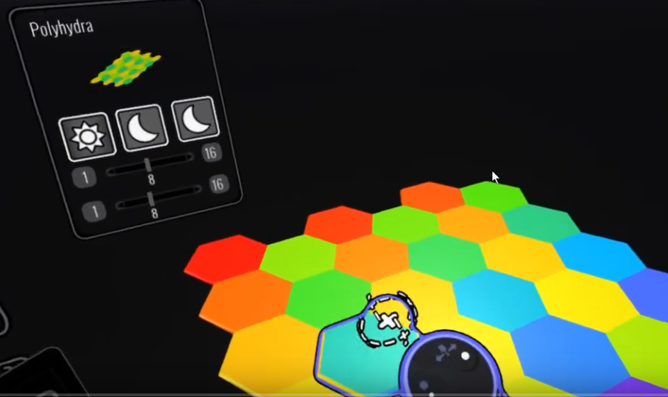
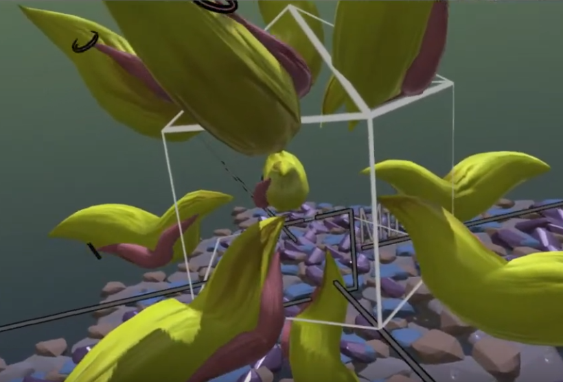

# Polyhedra-and-Symmetry

## Experimental Build 1: Symmetry

Downloads: [https://github.com/IxxyXR/open-brush/wiki/Downloads](https://github.com/IxxyXR/open-brush/wiki/Downloads)

### What does it do?

Mainly two related things:

1. Adds a polyhedra tool that can create a wide variety of polyhedra and grid patterns using brush strokes
2. Adds a custom symmetry tool similar to the existing mirror except it creates multiple strokes for each face of your selected polyhedra or grid

### What's it good for?

Creating regular patterns and geometry forms.

### How do I install it?

Download a build for your headset from the link above and unzip it. You can run the Windows exe directly. To install the Quest apk use SideQuest: [https://uploadvr.com/sideloading-quest-how-to/](https://uploadvr.com/sideloading-quest-how-to/)

### How do I use the Polyhedra tool?

1. Switch out of beginner mode and you'll see the "Experimental Tools" panel on your wand.
2. There is a new icon at the bottom that looks like a wireframe cube. Click that to activate the polyhedra tool. 
3. Draw a cube with your brush hand. Click once to start and release when you're happy with the size and rotation.
4. The "A" button or trackpad left click will cycle through various snapping angles. Try setting it to 90 to draw shapes level with the ground plane
5. The panel that opens when you first clicked the button let's you select various shape.
6. If you want to change the default colours simply add some custom colours at the bottom of the standard colour picker panel.

### Known Issues with the polyhedra tool

1. There's nothing to stop you creating extremely complex shapes that might slow everything down
2. There's currently no colour controls but you can use the standard recolor tool on your shapes.
3. Snapping is a bit unpredictable sometimesree paint mode. You need to select the polyhedra tool every time you change brushes.
4. Scene scale and brush size interact in a slightly confusing way.

### How do I use the new symmetry mode?

1. The button is on the bottom right of the Experimental tools panel. Use the same panel you used with the polyhedra tool to change the shape that controls the symmetry strokes.
2. The symmetry mode only affects normal paint strokes. You can't currently use symmetry to create multiple copies of the polyhedra tool.
3. You can grab the symmetry widget and change it's position and orientation.

### Known Issues with the custom symmetry mode

1. It's possible to create very complex sketches very quickly. 
2. There's no control over the color variation of the symmetry strokes.
3. You can't scale the grids. Instead scale your scene
4. I haven't added any way to control the colours of the additional strokes yet.

## How do I get help

Come over to the Open Brush Discord: [https://discord.com/invite/fS69VdFXpk](https://discord.com/invite/fS69VdFXpk) and chat to me \( andybak\#5425 \).

I'm on UK time \(currently UTC+1\) but I check in fairly regularly.

### Can I see it in action?

Here's an earlier version of the polyhedra tool: [https://www.youtube.com/watch?v=HRrJWFB11IU](https://www.youtube.com/watch?v=HRrJWFB11IU)

Here's a video with terrible audio showing the symmetry tool: [https://www.youtube.com/watch?v=Lnf6mS8xNIg](https://www.youtube.com/watch?v=Lnf6mS8xNIg) and another without any audio: [https://www.youtube.com/watch?v=xrsxaVxNMvY](https://www.youtube.com/watch?v=xrsxaVxNMvY)

Yeah. I really need to do better videos. Please share anything you make that I can use to show off the features.

