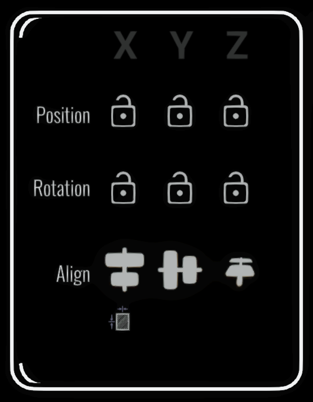
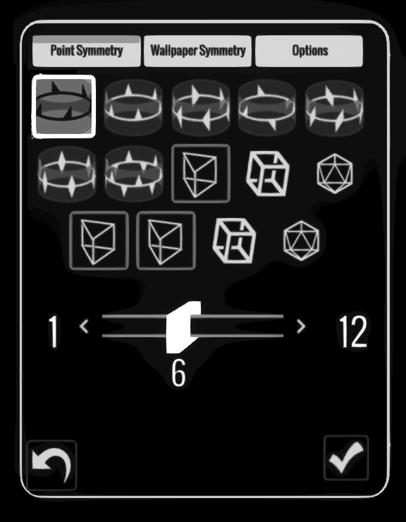

# v2.4 (Coming Soon)

## Multiple language support

You can now use Open Brush in six languages:

* French
* Spanish
* German
* Chinese
* Japanese
* Korean

If you'd like to help add more languages then please [get in touch](../../get-involved/)

## Transform Panel

<figure><figcaption></figcaption></figure>

Open Brush has traditionally been aimed at freehand drawing or painting but we've always wanted to improve workflows that require precise control over elements of your sketch. Guides help with this but the new Transform Panel adds some powerful tools to help with building complex scenes.

### Axis Locks

You can choose to lock any axis when moving or rotating a selection. Lock all rotation axis to maintain a consistent direction when duplicating selections. Or lock the Y axis to arrange copies in a perfect plane.

### Align Selected Objects

Similar to tools you are probably familiar with in desktop art apps - you can select multiple strokes, images, videos or 3d models and align them in any axis using their center-point or edges as a reference

## Improved Snap Settings

<figure><figcaption></figcaption></figure>

Closely related to the Transform Panel, we've souped up the Snap Settings to allow you more control and precision.

### Snap Axis Toggle

You can choose to have the snap grid only apply to one or more axis. Similar to the axis locks on the Transform Panel, this allows you to quickly create many copies of a selection whilst keeping as much regularity as you need.

### Snap Selected

Apply the current snap settings after the fact to multiple objects.

### Snapping to Guides

Guides are incredibly useful whilst painting. Now you can also make use of them when moving a selection of brush strokes (as well as images, videos or 3d models).&#x20;

## Multi-Mirror

<figure><figcaption></figcaption></figure>

The regular Mirror Tool is incredibly useful but for those of you who are interested in symmetry and geometric patterns, you'll find a lot to explore in the new Multi-Mirror Tool.

It supports dozens of types of symmetry and has powerful control of color variance for the replicated brush strokes.&#x20;

It also works when you duplicate selections - whether they are selected brush strokes, images, videos or even 3d models.

Don't forget that you can set a mirror spinning with a flick of your wrist. Combined with the new symmetry modes this allows many incredible patterns and shapes to be created.

## XR Keyboard

Does your sketches folder contain hundreds of sketches called "Untitled"? No more!

Currently used for renaming sketches and setting the names of layers - having a built-in keyboard will allow many previously difficult features in the near future.

## 360 Panorama Background Import

<figure><figcaption></figcaption></figure>

Load your own 360 paranoramas and replace the default environment background. We support jpeg, png and we've added support for .hdr files as well.&#x20;

Panoramas can also be stereoscopic. If your image's aspect ratio is 1:1 we assume it's an over/under stereo pair.&#x20;

Place images in your Media Library/BackgroundImages folder and they will appear in the new tab in the Media Library panel.

## New GLTF Importer

We love [GLTF](https://www.khronos.org/gltf/) as a format for 3d models. It's open, extensible and widely supported. Our original GLTF importer was showing it's age so we've added a brand new one based on [GLTFast](https://github.com/atteneder/glTFast). This supports a much broader range of features and should be able to open any valid GLTF or GLB file you throw at it.

Particularly exciting is the support for animated 3d models.

## SVG importer

Just by placing SVG files in either your Media Library/Images folder or your Media Library/3D Models folder, you'll be able to import them either as raster images or as 3d meshes.

We plan to allow new ways to make use of vector images in the near future including recoloring, extruding, splitting and layering of the elements.

## Repaint Selection

Last year we added powerful tools for changing the brush type, color or size of existing strokes but it required you to manually interact with every stroke you wanted affected. We've changed the UI for the repaint tools and added the ability to apply the various changes to all currently selected brush strokes. &#x20;

## Webcam Viewer

Suggested by [Shawn Chiki](https://shawnchiki.xyz/) who has been doing very cool live performances using Open Brush, this adds a panel that displays the view from any attached webcam. Intended for live streaming and other performance work it can help you keep track of what others will see.

There are plenty of other potential uses though. Combined with [OBS](https://obsproject.com/) you can view input from a huge range of potential sources - capture another app's screen. How about viewing a tutorial or live stream from another artist while you work?

(This feature is currently PC VR only)

## Passthrough Room Scale

A small change with a big impact. Your Open Brush scene now stays in a stable orientation relative to your VR space. Combined with passthrough you can paint your surroundings and they will be in the correct position when you come back to the sketch at a future time.

We've also added a "lock/unlock scene transform" button which defaults to "locked" when you're in passthrough mode as well as a "reset scene transform" so you can easily switch get back to the original alignment between your sketch and the real world.

## Quest 1 Support is back

We sadly broke support for selection tools on the Quest 1 in a previous release due to moving our rendering mode from OpenGL ES to Vulkan. We've managed to fix this now so those of you with the older headset can use all the tools in Open Brush once again. We're committed to supporting the Quest 1 for as long as we can.

## Audio Reactive Mode for Quest

PC VR users will be familiar with the audio reactive mode that allows many of the brushes to animate in response to music you play on your PC. We've now enabled this mode for the Quest as well. Currently you need to import the audio as an mp4 video file but we plan to add support standard audio files as well as spatial audio and trigger modes for multiple clips.&#x20;

## Camera Paths on all headsets&#x20;

You can now create and edit camera paths on the Quest and other standalone headsets. You currently can't generate a video directly from the headset. However we can copy your sketches to any PC or Mac (it doesn't have to be a VR capable PC) and render a video there. See below.

## Render Video on any computer

It was always possible to view sketches on non-VR devices and you could trigger video rendering using the [API](../../user-guide/open-brush-api/). We've made a few changes to make things easier:

1. We've added [ffmpeg](https://ffmpeg.org/) to our Mac builds (previously it was PC only)
2. There's an example script you can use that will let you load a sketch and trigger video rendering without needing to figure out how to use [monoscopic mode](../../developer-notes/github-wiki/monoscopicmode.md)
3. We've uploaded a Mac build to [Itch.io](https://openbrush.itch.io/openbrush) and we'll add more platforms and app stores over time.

## Flatscreen View Mode

We want to make viewing and sharing sketches easier. One step towards this is that you can run Open Brush even on devices without VR support. Instead of showing an error message, we now offer a simple UI that allows you to open any local sketch and navigate using the keyboard or touchscreen. The regular Steam PC version works fine for this - we tried it out on a [Steam Deck](https://store.steampowered.com/steamdeck) and it worked pretty well! We want to improve the navigation controls and support other input devices such gamepads.

We also plan to make it easier to get a build of Open Brush for any platform. The Viewing Mode should run fine on PC, Mac, Android or iOS so keep an eye out for releases on all these platforms. &#x20;

## Small things

* Move selection to current layer
* JSON exports now also include sketch metadata&#x20;
* Precise slider control using thumb stick&#x20;
* WebSocket support for API requests

## Want More?

A lot of the features in this release will be expanded further. Don't forget to check out our other work [in progress](../../alternate-and-experimental-builds/) - some of which will move into beta very soon - along with something else which is probably the most frequently requested feature of all time. ;-)
