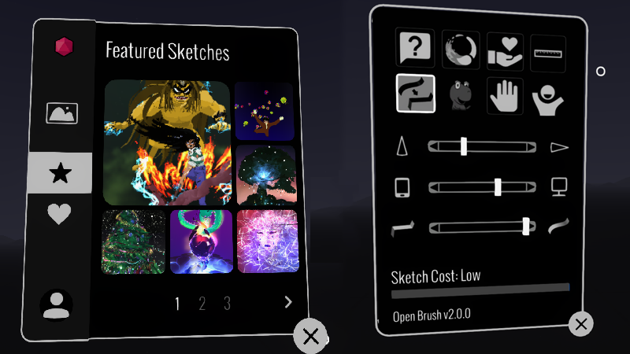

# v2.2: Settings and Sketches

<figure><figcaption></figcaption></figure>

## Features

### Bundled "Featured Sketches"

Since Google Poly closed down, the immediate access to some examples by talented artists was sorely missed.  So we've added some of the classics back in. We have big plans for sharing and viewing artwork so this is just the start.

### Add a button in Setting to switch handedness

Previously the only way to do this was to tap the bottom of the controllers together. This wasn't easy to discover and was unreliable when using some controllers.  We've kept that in but added a nice clear button the app settings.

### Add a button in Setting to reset the "First Time Use" tutorial

This is something that's especially useful when you want to demo Open Brush to a new user. The current tutorial is very brief but we hope to expand it in the future. Note this button affects the app the next time you launch it.

## Known Issues

* Meta Quest: Incorrect or missing video thumbnails are shown
* Meta Quest: Gif capture results in just a black image
* Meta Quest (Quest 1 only): Selection and erase tools are not working
* Valve Index Controllers: Grip is too sensitive. It's easy to accidentally trigger a grab when drawing.
* Issues with controllers not appearing when the wrong OpenXR runtime is selected. Please see: [https://vermillion-vr.com/support/](https://vermillion-vr.com/support/) for some workarounds.

