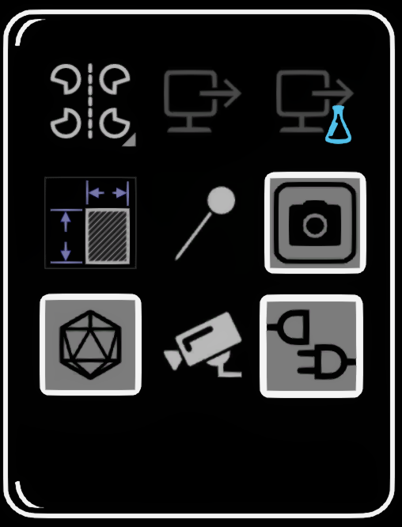
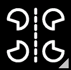
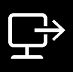
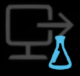
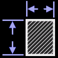
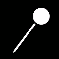

# Check out Labs features

<figure><figcaption></figcaption></figure>

To try out newer features, you can open up the Labs panel. Here you will find some of the latest additions to Open Brush.

(If you're really interested in cutting edge features then you might also want to look at installing [alternate or experimental builds](../alternate-and-experimental-builds/).)

### **Accessing the Labs panel**

1. Make sure you are in Advanced Mode.
2. Below your palette, go to the Menu panel and select "**More Options...**".
3. On your paint palette, swipe to the Tools panel and select More.
4. Select **Labs**.

## Labs Features:

### [Gaussian Splat Pose Capture](exporting-videos/gaussian-capture.md)

Add capture-volume widgets and export images, camera poses and sparse point data for Gaussian splat training.

### [**Multi Mirror**](multimirror.md)

<figure><figcaption></figcaption></figure>

### [Export your sketch as a 3d file](exporting-open-brush-sketches-to-other-apps/)

<figure><figcaption></figcaption></figure>

### [Save Selected Strokes to your Media Library](importing-images-videos-3d-models.md#save-and-reuse-selected-strokes)

<figure><figcaption></figcaption></figure>

### Hide or show Draft Brush strokes

<figure><figcaption></figcaption></figure>

### View a live webcam or other video feed while drawing

<figure><figcaption></figcaption></figure>

### Use the "Pin" tool

<figure><figcaption></figcaption></figure>

### Switch the desktop view to a spectator camera

<figure><figcaption></figcaption></figure>

***

The Icosa Gallery model browser and [Plugins and Scripts](using-plugins/) are on the [Extras panel](using-the-open-brush-tools-quick-tools-and-menu-panels/extras-panel/), rather than the Labs panel.
