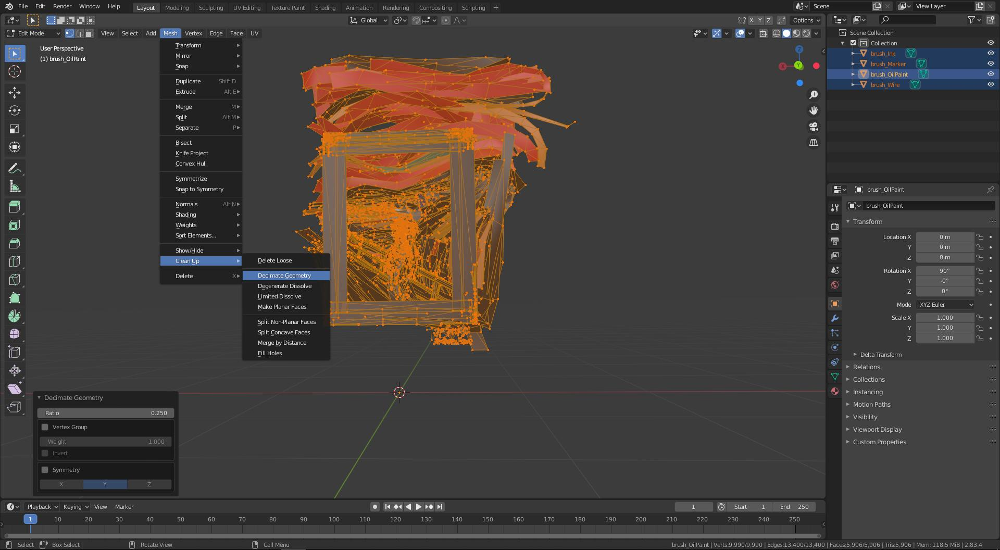
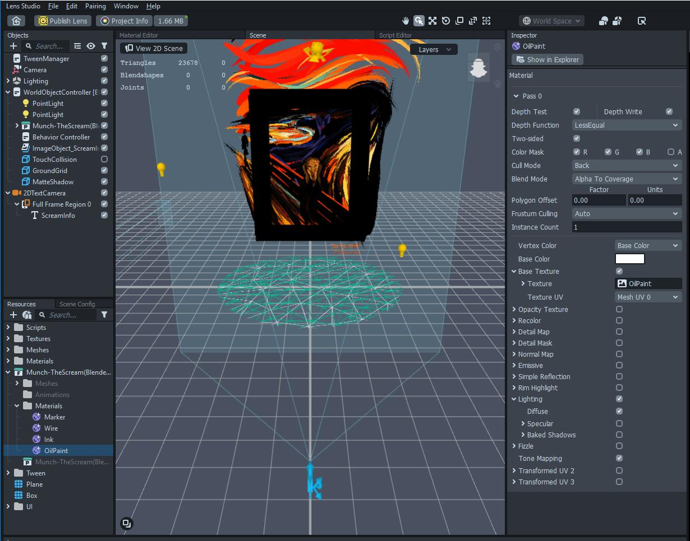

# Exporting to Snapchat Lens Studio

### Tilt Brush → Blender → Snap Lens Studio 

NOTE: Not all Tilt Brush brushes will export (e.g. particle brushes) The most reliable are the flat brushes and the Wire brush. Also, this process might not be compatible with Tilt Brush on the Quest as the export function works differently than the Rift.

### Tilt Brush to Blender: 

* **NOTE:** Tilt Brush’s settings exports the FBX as an ASCII model. Blender won’t accept it, and you’ll receive an error message in Blender: "ASCII FBX files are not supported"\

* To change the Tilt Brush FBX configuration from ASCII to Binary, follow these instructions to **set up your Tilt Brush.cfg file:** [https://docs.google.com/document/d/11ZsHozYn9FnWG7y3s3WAyKIACfbfwb4PbaS8cZ\_xjvo/preview#heading=h.g9ac8b39hgn0](https://docs.google.com/document/d/11ZsHozYn9FnWG7y3s3WAyKIACfbfwb4PbaS8cZ\_xjvo/preview#heading=h.g9ac8b39hgn0)\

* Add this CFG setting:

"Export": {

"ExportBinaryFbx": true,

"ExportFbxVersion": "FBX201400"

}

* Within Tilt Brush (in VR):
  * Swipe to the Tools panel
  * Select "More Options..." > Labs > Export.
  * An .fbx file, brush texture, and geometry will be saved to your desktop computer’s **Documents/Tilt Brush/Exports** folder.\

* For most optimization, consider taking the exported .PNGs and processing them thru [https://tinypng.com/](https://tinypng.com/) to compress them even more.
* **In Blender:**\
  (Major credit to [Jose Andres Rosero](https://twitter.com/never\_render) for helping me out with this part!)\

This helps merge vertices that are close together, and saves on polys

* Then, on the MESH subtab, go to Clean-up > Decimate Geometry\

* In the pop-up menu for Decimate, enter the ratio of how much to decimate. I entered 0.25.\
  ([https://drive.google.com/file/d/1qSM1ss9mMXxbh689WwgDVJP8ZIxPjGkE/view?usp=sharing](https://drive.google.com/file/d/1qSM1ss9mMXxbh689WwgDVJP8ZIxPjGkE/view?usp=sharing))\
  \

* Export the FBX

### Blender to Snap Lens Studio: 

* Import the decimated FBX model from Blender\

* Rename Materials, (ex: from “13981290382\_Marker” to “Marker”)\

* Drag and drop the TinyPNG optimized imgs into the Lens Studio > Resources > Textures folder\

* In the Resources > \[ 3D Model Name ] folder > Materials, select the Material.\

* In the Inspector for the Material:
  * For the Blend Mode, select anything other than “Disabled” — I preferred Normal or Alpha to Coverage\

  * For the Vertex Color dropdown, select “Base Color”\

  *   For the Base Texture, check to enable, add the Tilt Brush texture here

      
