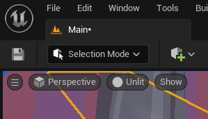
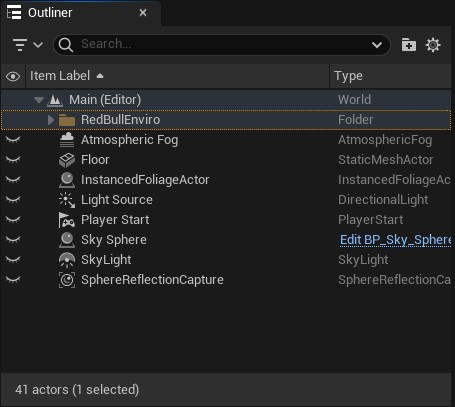
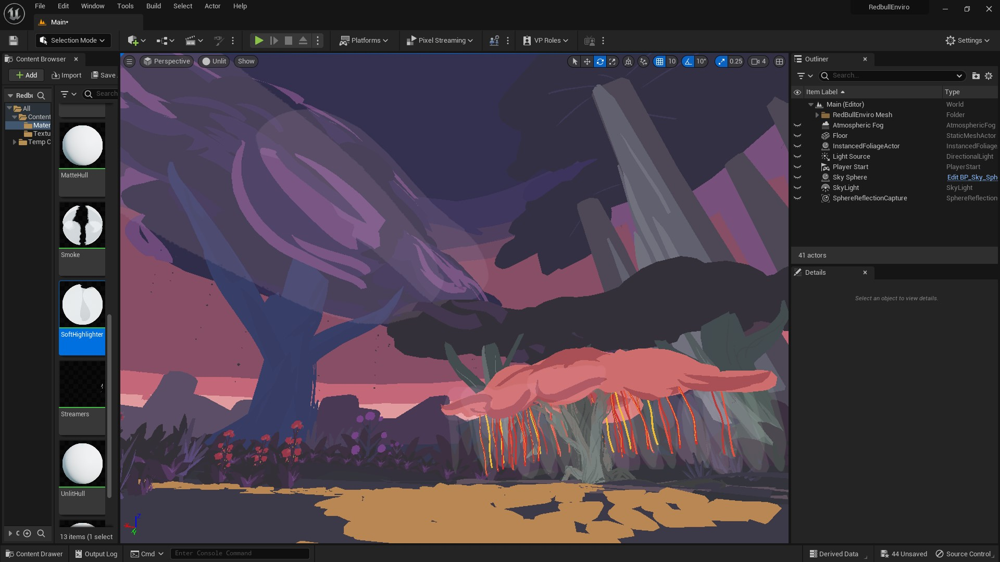

# Exporting to Unreal Engine 5

How to Import OpenBrush FBX files & edit Materials to appear correctly

This example uses models that are best viewed without lighting. In UE5's scene view, change the scene lighting to "UNLIT" (top left of window).

* Drag the FBX from Windows Explorer into the UE5 scene
*   An FBX Import Option menu will come up:\

    

    Make sure to select: **Advanced > Vertex Color Import Option \[REPLACE]**

### **Organize Materials, Textures, Mesh Files** 

* Upon importing the FBX, the _Content Drawer_ will include the meshes and materials
* Create a subfolder for _MATERIALS_ and _TEXTURES_
*   Select the imported materials, drag and drop them into the newly created _MATERIALS folder_\

    
*   The materials are pretty terribly named. I highly recommend renaming them. The brush material names are at the end of the filename:\

    
*   From Windows Explorer, drag optimized PNG brush textures into the UE5 _TEXTURES_ folder:\

    
*   From the _CONTENT DRAWER_, drag and drop the meshes into the scene. I recommend creating a folder in the _OUTLINER_ window and drag all the mesh objects into there:\

    

    Selecting all the model mesh objects, it may help to update these DETAILS:

    Location: 0,0,0 Scale: 0.5,0.5,0.5
*   I also recommend turning off visibility of all the other non-mesh objects in the OUTLINER tab (e.g. Atmospheric Fog, Floor, etc.)\

    

### Associate Vertex Colors, Textures, Opacity to Materials 

**Edit Vertex Colors to Materials that&#x20;**_**only**_**&#x20;need Vertex Colors:**

| Material Name | NODE: Vertex Color | NODE: Texture Sample | Material Details               |
| ------------- | ------------------ | -------------------- | ------------------------------ |
| **Flat**      | ✓                  | No                   | Blend Mode: MASKED ☑ Two Sided |
| **MatteHull** | ✓                  | No                   | Blend Mode: MASKED ☑ Two Sided |
| **UnlitHull** | ✓                  | No                   | Blend Mode: MASKED ☑ Two Sided |
| **Wire**      | ✓                  | No                   | Blend Mode: MASKED ☑ Two Sided |

* In CONTENT DRAWER > _MATERIALS,_ double click the "Flat" material file. The Material Graph window will popup
* Right click on the empty grid, type in _VERTEX COLOR_ to add the node

Connect the top white dot to _BASE COLOR_ in the "_FLAT"_ window.

* Click on "FLAT" so you can see its _DETAILS_ on the left menu
* Update: **BLEND MODE** - MASKED **Two Sided** - \[checked]​

That's it! Be sure to save these edits or CTRL + S. The edits won't show up on the main scene window until these Material changes are saved.

* Repeat for the other three materials listed above that only need Vertex Colors associated to the materials.

**Edit Materials that need Vertex Colors and Texture Sample:**

| Material Name           | NODE: Vertex Color | NODE: Texture Sample            | Material Details               |
| ----------------------- | ------------------ | ------------------------------- | ------------------------------ |
| **DiamondHull**         | ✓                  | ✓ RGBA connects to Opacity Mask | Blend Mode: MASKED ☑ Two Sided |
| **Dots**                | ✓                  | ✓ RGBA connects to Opacity Mask | Blend Mode: MASKED ☑ Two Sided |
| **DoubleTaperedMarker** | ✓                  | ✓ RGBA connects to Opacity Mask | Blend Mode: MASKED ☑ Two Sided |
| **Embers**              | ✓                  | ✓ RGBA connects to Opacity Mask | Blend Mode: MASKED ☑ Two Sided |
| **Marker**              | ✓                  | ✓ RGBA connects to Opacity Mask | Blend Mode: MASKED ☑ Two Sided |

* Do the same steps above to add VERTEX COLOR to the BASE COLOR
* Do the same steps above to update the Material Details to (same as before): **BLEND MODE** - MASKED **Two Sided** - \[checked]
*   Right click the empty grid space and type in _TEXTURE SAMPLE_ to bring up a node where you'll associate the texture png files

    

    * Click on the _TEXTURE SAMPLE_ node window so you can edit the _DETAILS_
    * In the section for "Material Expression Texture Base" click on the dropdown to select the texture name that matches with the material name.
      * _NOTE_: The DoubleTaperedMarker material can use the "Marker" texture
    * Connect the _TEXTURE SAMPLE_ node's "RGBA" dot to the Material's "Opacity Mask" dot
* REPEAT for the other materials with same properties

**Edit Materials that need Vertex Colors, Texture Sample, and Transparency:**

| Material Name       | NODE: Vertex Color | NODE: Texture Sample       | Material Details                 |
| ------------------- | ------------------ | -------------------------- | -------------------------------- |
| **Highlighter**     | ✓                  | ✓ RGBA connects to Opacity | Blend Mode: ADDITIVE ☑ Two Sided |
| **Smoke**           | ✓                  | ✓ RGBA connects to Opacity | Blend Mode: ADDITIVE ☑ Two Sided |
| **SoftHighlighter** | ✓                  | ✓ RGBA connects to Opacity | Blend Mode: ADDITIVE ☑ Two Sided |

* Do the same steps above to add VERTEX COLOR to the BASE COLOR
* Update the Material Details: **BLEND MODE** - ADDITIVE **Two Sided** - \[checked] "Additive" will allow these brushes to appear semi-transparent, foggy, smokey.
* Do the same steps as above to associate textures to _TEXTURE SAMPLE_ node

* Connect the _TEXTURE SAMPLE_ node's "RGBA" dot to the Material's **"Opacity"** \[not Opacity Mask as previous materials]
* REPEAT for the other materials with same properties

Make sure to save all of your Material window edits!

Make sure to view this in "unlit" mode.

Also hide the Light Source, etc to prevent any shadows from showing up in the scene.

Reward yourself with ice cream.

_Docs contributed by_ [_Estella Tse_](https://www.estellatse.com/)_. Additional thanks to_ [_Steve Bowler_](https://www.linkedin.com/in/stevebowler/)&#x20;
