# Camera Paths Tool

Camera Paths lets you record video by moving a camera along a path. It’s the core “virtual cinematography” tool in Open Brush.

Once you start recording a path, other tools are locked. If you cancel mid-recording, the partial video is discarded.

<figure>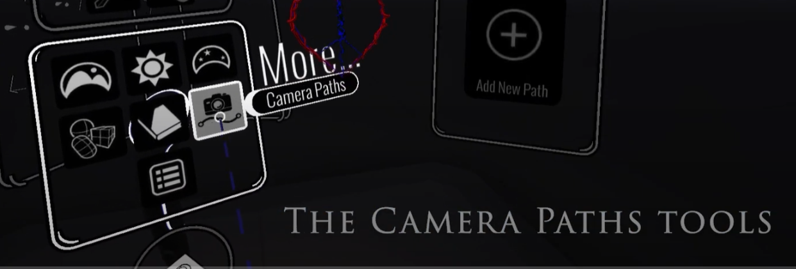<figcaption>
The Camera Paths tool opens a dedicated panel.
</figcaption></figure>

### Create your first path

If you have no paths yet, you’ll only see **Add New Path**.

<figure>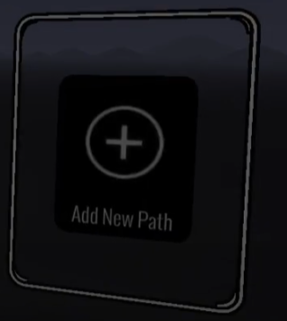<figcaption>
Create a path first. Other tools unlock after that.
</figcaption></figure>

Create a path with 2+ anchor points.

After that, you’ll see the full set of tools:

<figure>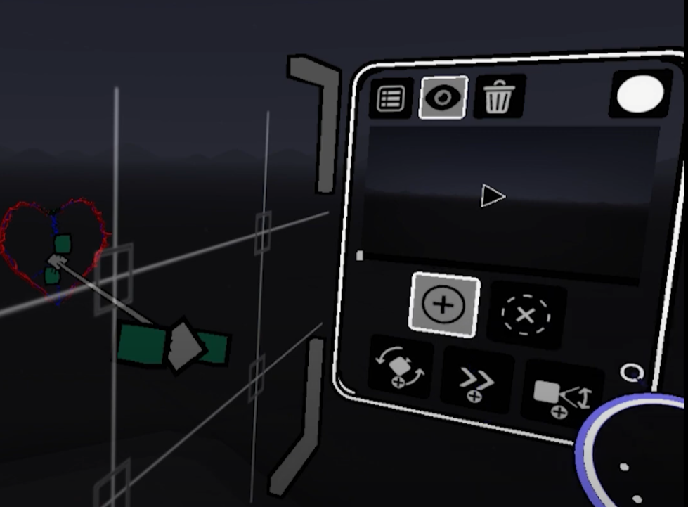<figcaption>
The panel after a path is created.
</figcaption></figure>

### Tools

#### Select Path

Choose which existing path you want to edit.

<figure>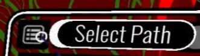<figcaption>
Select Path
</figcaption></figure>

#### Show Paths

Shows paths in the sketch so you can manipulate them.

<figure>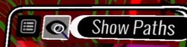<figcaption>
Show Paths
</figcaption></figure>

#### Delete Path

Deletes the entire selected path.

<figure>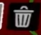<figcaption>
Delete Path
</figcaption></figure>

#### Record Path

Renders a video by moving the camera through the full path. The output video appears in `Documents/Open Brush/Videos`.

Recording cannot be paused. Cancel by clicking the **X** on the brush controller while recording.

<figure>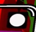<figcaption>
Record Path
</figcaption></figure>

#### New Anchor Point

Adds an anchor point to the path. If you add to either end, it stays active for adding more points.

<figure>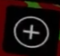<figcaption>
New Anchor Point
</figcaption></figure>

#### Delete Anchor Point

Deletes any control point on the timeline. That includes anchor, direction, speed, and zoom points.

<figure>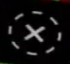<figcaption>
Delete Point
</figcaption></figure>

#### Camera Direction Point

Controls where the camera points. Direction points blend with nearby direction points for smooth motion.

<figure>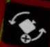<figcaption>
Camera Direction Point
</figcaption></figure>

#### Camera Speed Point

Controls how fast the camera moves. Values range from `0.1` to `100`. Speed blends between points.

<figure>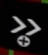<figcaption>
Camera Speed Point
</figcaption></figure>

#### Camera Zoom (FOV) Point

Controls field of view over time. Values range from `10` to `140`. FOV blends between points.

<figure>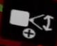<figcaption>
Camera Zoom Point
</figcaption></figure>

### Practical notes

Camera Paths can be time consuming. Each control point affects the timeline before and after it.

The tool is only accessible after the sketch is fully rendered. So it can’t capture the rendering process itself.
