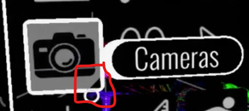
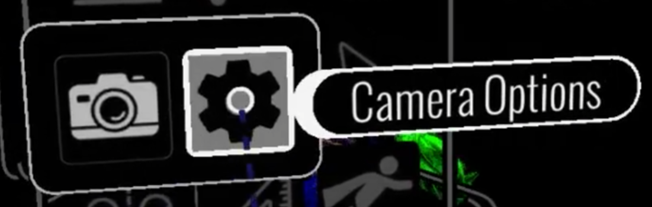
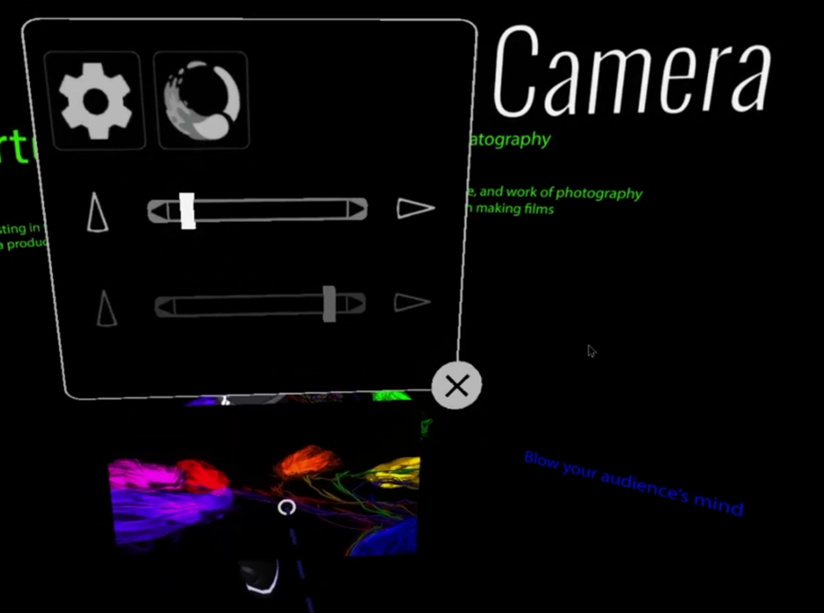
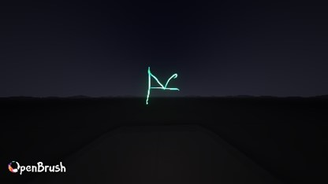
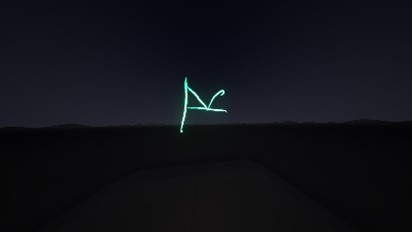
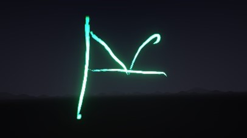
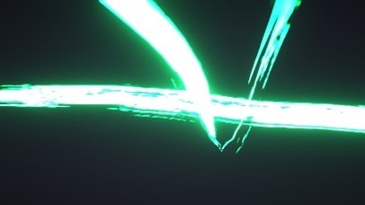

# Camera tool (GIFs, snapshots, video)

Open Brush has a handheld camera tool for quick captures. You use it for GIFs, conventional or 360° snapshots, depth captures, and (on PC VR) video.

### Where captures are saved

Snapshots and depth captures are saved to:

* `Documents/Open Brush/Snapshots`

Videos and GIFs are saved to:

* `Documents/Open Brush/Videos`

### Beginner mode

In Beginner mode, the camera icon is a single-function tool. It opens camera controls on your brush controller.

The options are:

1. Auto-Gif
2. 5 Second Gif
3. Snapshot
4. 360 Snapshot
5. Depth
6. Video (not present on every platform)

You control the camera like a handheld device.

* Swipe left/right on the thumbpad to switch modes.
* Pull the trigger to capture.

#### 5 Second Gif

Hold the trigger for five seconds. You can release and pull again to stop/start on the same 5-second timeline.

#### Video

Pull the trigger to start. Pull again to stop.

This is true handheld capture. You control camera direction, speed, and orientation.

#### 360 Snapshot

Pull the trigger to create a stereoscopic 360° ODS image from the camera's position. The output is a square PNG with `_360` in its filename and uses the configured `SnapshotWidth`. Capturing takes longer than a conventional snapshot; keep the camera and scene still until it completes.

#### Depth

Pull the trigger to save a colour image and several depth sidecar files with the same base filename:

| Suffix | Contents |
| --- | --- |
| `_depth.png` | Viewable normalized depth; nearer pixels are lighter. |
| `_depth16.png` | 16-bit linear depth suitable for image-processing tools. |
| `_depth.exr` | 32-bit floating-point linear depth in metres. |
| `_depth.json` | Dimensions, clipping planes, FOV and encoding information needed to interpret the depth files. |

Pixels where no geometry was rendered use the invalid value documented in the JSON metadata. Post-processing and the watermark are disabled for the depth data.

Depth captures are limited to 8,192 pixels on their largest side. If the configured snapshot dimensions are larger, Open Brush scales them down while preserving the aspect ratio.

### Automated colour, depth and normal capture

The HTTP API's `app.snapshot` command captures a colour image, depth sidecars and a `_normals.png` image from an explicit camera pose. See the [API Commands List](../open-brush-api/api-commands.md#app.snapshot) for its parameters and an example.

### Advanced mode (Camera Options)

In Advanced mode, the camera icon has a sub-menu. You’ll see a small triangle in the corner.

Click and hold to open the sub-menu. Then choose **Camera Options**.

<figure><figcaption>
The Cameras icon in Advanced mode has a sub-menu.
</figcaption></figure>

<figure><figcaption>
Camera Options is inside the Cameras sub-menu.
</figcaption></figure>

In **Camera Options**, you can:

* Toggle the Open Brush watermark.
* Adjust field of view (FOV) and smoothing.
* Toggle post effects.

<figure><figcaption></figcaption></figure>

#### FOV examples

These examples show FOV set to 140, 70, and 10. The first image has the watermark enabled.

<figure><figcaption>
FOV 140 (wide angle), watermark on
</figcaption></figure>

<figure><figcaption>
FOV 140, watermark off
</figcaption></figure>

<figure><figcaption>
FOV 70
</figcaption></figure>

<figure><figcaption>
FOV 10
</figcaption></figure>

### Demo video

This demo was recorded via the Spectator Camera.


