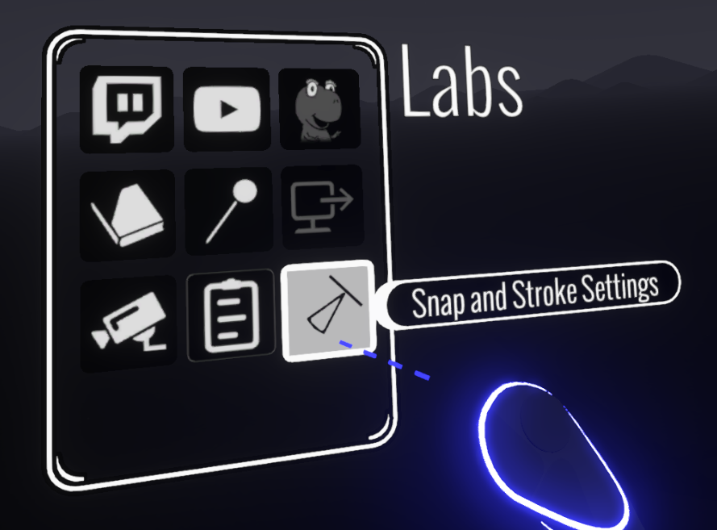
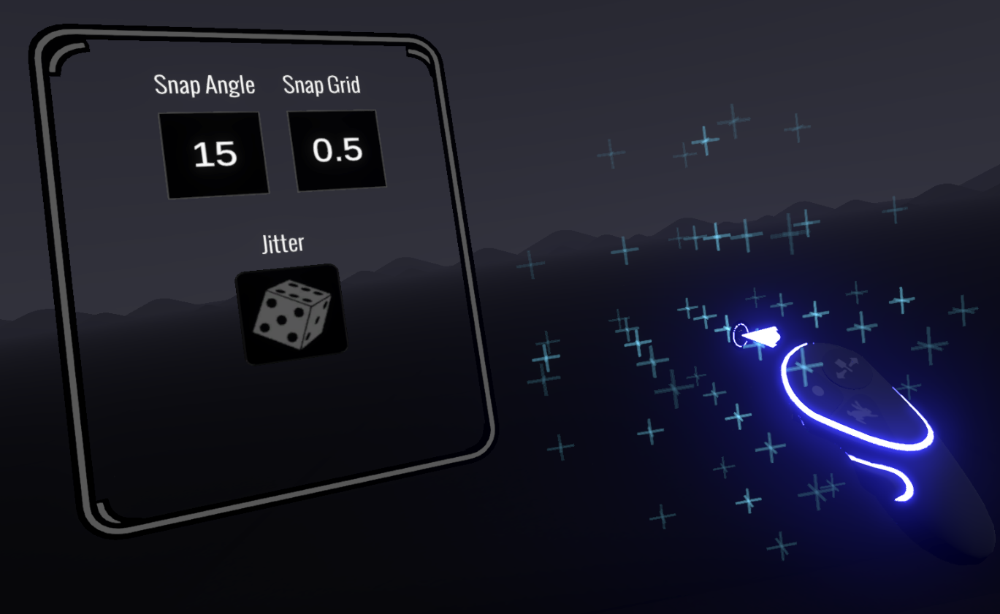

# Grid and Angle Snapping

### What does it do?

1. Snap selections to a grid. Duplicate selections at precise positions
2. Draw brush strokes that align with the grid (especially useful with the hull brush)
3. Snap the rotation of selections to a chosen angle (i.e. 15, 45 or 90 degrees)

### What's it good for?

Drawing along straight x, y or z lines. Building regular structures up by making multiple copies of brush strokes

### How do I use it?

<figure><figcaption></figcaption></figure>

Click the button shown above on the [Extras Panel](using-the-open-brush-tools-quick-tools-and-menu-panels/extras-panel/) to open the new Snap Settings panel:

Click the Snap Angle or Snap Grid buttons to cycle through angles and grid sizes.

The Jitter button is the same as the the button on the Color Picker. It's included here for convenience as [position jitter and other settings ](repaint-tool.md#jitter-positions)can be useful with snapped brush strokes.

### Can I see it in action?


