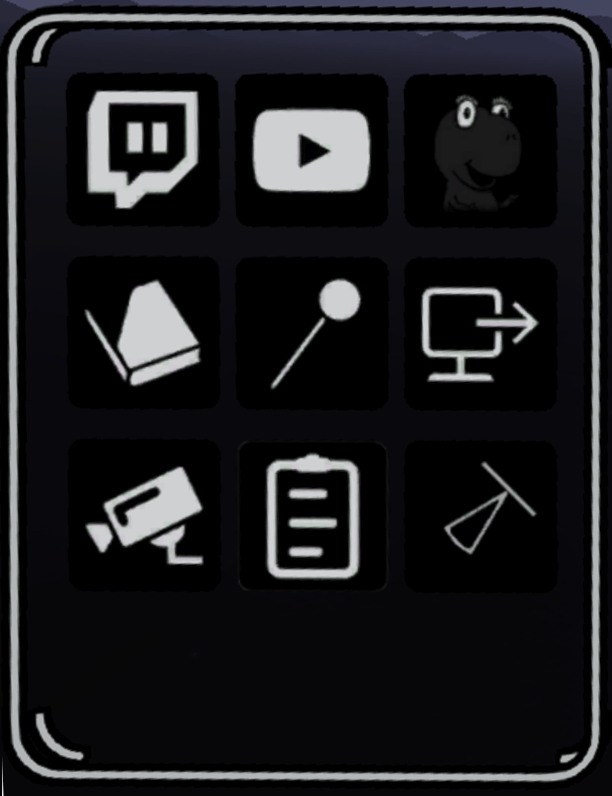

# Importing Images, Videos and 3D Models

The Media Library lets you place reference images, videos, 3D models and reusable groups of brush strokes in a sketch.

## Open the Media Library

1. Switch to **Advanced Mode**.
2. Open the **Extras** panel.
3. Select **Local Media Library**.
4. Use the tabs at the top of the library to switch between images, videos, models and saved strokes.

<figure><figcaption></figcaption></figure>

You can organize imported media into subfolders. See [Folder Navigation](folder-navigation.md) for details.

## Add an image or video

1. Copy images to `Documents/Open Brush/Media Library/Images` or videos to `Documents/Open Brush/Media Library/Videos`.
2. Open the Media Library and choose **Local Images** or **Local Videos**.
3. Select a thumbnail to add that item to the sketch.

## Use a 360 background image

Panoramic background images replace the environment sky rather than appearing as movable image widgets.

1. Copy a JPEG, PNG or HDR panorama to `Documents/Open Brush/Media Library/BackgroundImages`.
2. Open **Extras > Local Media Library** and select **Background Images**.
3. Select a thumbnail to apply the panorama to the scene.

The thumbnail is rendered on a preview sphere so you can see how the panorama wraps before selecting it. A 2:1 equirectangular image is treated as monoscopic. A 1:1 image is treated as an over-under stereoscopic panorama, with one eye's view above the other.

Background-image folders and subfolders can be browsed with the same [Folder Navigation](folder-navigation.md) controls as other local media.

## Add a 3D model

1. Copy a supported 3D file to `Documents/Open Brush/Media Library/Models`.
2. Open the Media Library and choose **Local Models**.
3. Select a thumbnail to add that model to the sketch.

On standalone headsets, model importing may need to be enabled in **Settings > Experimental**. Large or complex models can take time to load and may affect performance.

## Supported file formats

| Type | Format | Notes |
| --- | --- | --- |
| Images | PNG, JPEG, HDR |  |
| Images or 3D models | SVG | SVG files can be imported as either images or meshes. |
| Video | MP4, MKV, MOV | Support depends on the operating system and installed codecs. |
| Video | WEBM | Must use the VP8 codec. Transparency is supported on Windows only. |
| 3D models | GLTF, GLB, OBJ | Supported on desktop and standalone devices. |
| 3D models | FBX | PC and Mac only. |
| 3D models | USD | PC and Mac only; support is experimental and uses an older importer. |
| 3D models | PLY | Binary little-endian point clouds only. |
| 3D models | VOX | MagicaVoxel voxel models. |

### GLTF and GLB models

GLTF and GLB are the preferred formats for portable 3D scenes. Open Brush's current importer supports scene hierarchies, materials, lights and animations, with a legacy importer used as a fallback when the primary import fails.

When an imported file contains animation clips, Open Brush starts one clip automatically. Animation controls and choosing between several clips are not currently exposed in the Media Library.

### SVG files

Copy an `.svg` file to `Documents/Open Brush/Media Library/Images` to use it as a flat reference image, or to `Documents/Open Brush/Media Library/Models` to import its shapes as a 3D mesh. SVG reference images are rasterized when a sketch is exported to a format that cannot retain the SVG texture directly.

### VOX models

Open Brush imports MagicaVoxel `.vox` files through the Local Models tab. To keep a voxel model aligned to its original grid, set position snapping to `0.1` and rotation snapping to `90` before placing it. See [Grid and Angle Snapping](grid-and-angle-snapping.md).

### OBJ models

The OBJ importer triangulates polygon faces, including faces with more than four vertices. Keep the matching `.mtl` file and texture files beside the OBJ file, preserving any relative paths used by the material file.

### Open Blocks models

Open Brush also searches the local model library created by [Open Blocks](https://openblocks.app/). Models saved locally in Open Blocks appear in the Local Models browser without needing to be copied into the Open Brush Models folder.

Open Blocks stores each offline model in its own folder. Open Brush presents those models through the same folder browser used for other local models.

### Point clouds

Open Brush imports binary little-endian PLY point clouds. Copy them to `Documents/Open Brush/Media Library/Models` and open the Local Models tab.

### WebM video

WebM supports transparent backgrounds, which is useful for effects, animated sprites and reference footage. The file must use the VP8 codec. Transparency is currently supported on Windows only.


Video support varies by operating system and hardware. Windows codec support is documented in [Microsoft's Media Foundation format reference](https://learn.microsoft.com/en-us/windows/win32/medfound/supported-media-formats-in-media-foundation#video-codecs).


## Split a 3D model into separate parts

Open Brush can break an imported model into separate widgets. It first separates model nodes and can continue splitting a single mesh into disconnected pieces.

1. Select one imported 3D model with the Selection tool.
2. Use the **Break Apart** control in the selection options. This occupies the same control used to group regular selections when the selected model can be split.
3. Confirm **Split Mesh**.
4. Repeat the operation on a resulting part if it contains more disconnected pieces.

Splitting a complex mesh may take time. Save the sketch before splitting a large model. Split parts retain their material assignments, and the operation is undoable.

## Save and reuse selected strokes

The Saved Stroke Gallery stores selected brush strokes as `.tilt` files. Unlike exporting a selection as a 3D model, this keeps the strokes editable: after loading them you can ungroup, recolor, rebrush and edit them normally.

### Save a selection

1. Use the Selection tool to select the strokes you want to reuse.
2. Open **More Options... > Labs**.
3. Select **Save Selected Strokes**.
4. Open **Extras > Local Media Library > Saved Strokes** to see the new item.

Saved-stroke files are stored in `Documents/Open Brush/Media Library/Saved Strokes`. A new installation also includes several example items.

### Add saved strokes to a sketch

1. Open **Extras > Local Media Library > Saved Strokes**.
2. Select an item from the gallery.
3. Open Brush places the strokes in the active layer, groups them and selects the new group so you can position it immediately.

Loading a saved-stroke item is undoable. Ungroup it if you want to edit individual strokes.

## Move, resize, pin or remove imported objects

1. **Move:** Hold a Grip button while pointing at an image, video or model, move it, then release the Grip button.
2. **Resize:** Hold both Grip buttons near the object and move the controllers closer together or farther apart.
3. **Pin:** While holding the object with Grip, pull the trigger. You can also use the Pin tool.
4. **Remove:** Grab the object, flick it away and release, or touch it with the Eraser tool.
