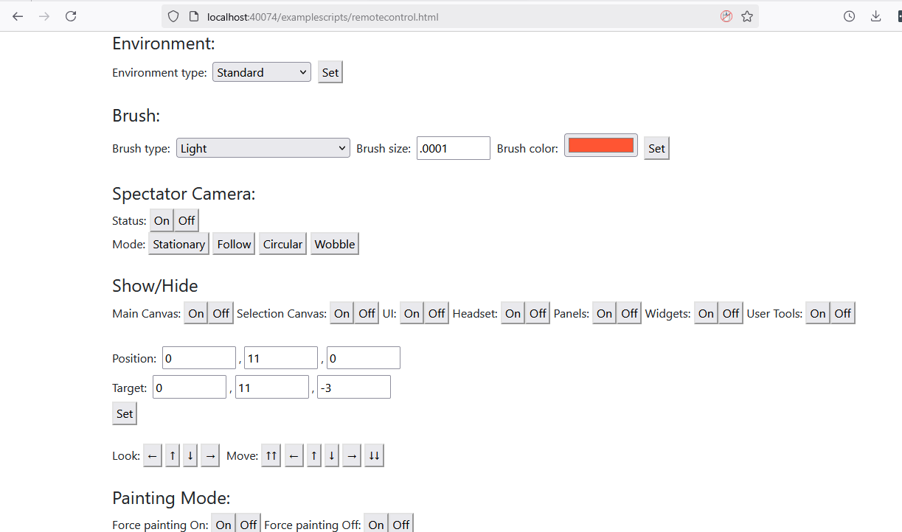

# Using Open Brush without a VR headset


Open Brush has two non-VR modes. **View-only mode** is the recommended way to browse and explore sketches on a flat screen. **Monoscopic mode** exposes painting tools for specialist and debugging workflows.


## View-only Mode

<figure><figcaption></figcaption></figure>

If you launch Open Brush without a headset attached, the app starts in View-only mode. Dedicated viewer builds also start in this mode. Painting tools are hidden so you can concentrate on browsing and exploring sketches.

### Browse sketches

Open the Sketchbook to browse a thumbnail grid. **Local Sketches** contains work saved on the device; the other tabs contain sketches available from the Icosa Gallery. Select a thumbnail to load the sketch, then use the Fly controls to explore it.

### Keyboard and mouse controls

1. Drag with the mouse to look around.
2. Use **W**, **A**, **S** and **D** to move forward, left, backward and right.
3. Use **Q** and **E** to move down and up.
4. Hold **Shift** to move faster.
5. Press **I** to invert the vertical look direction.

### Touchscreen controls

1. Drag on the scene to look around.
2. Use the on-screen joystick to move horizontally.
3. Use the up and down buttons to move vertically.
4. Use the Sketchbook button to choose another sketch.

### Start without XR

If a VR headset is attached, you can still start without XR by adding `DisableXrMode` to the `Flags` section of your [Open Brush config file](the-open-brush-config-file.md):

```json
{
  "Flags": {
    "DisableXrMode": true
  }
}
```

You can return to normal either by removing the entry or by setting it to false.

### Plugins and Scripting in Desktop Mode

Another great use case for Desktop Mode is in conjunction with either or both the [HTTP API](open-brush-api/) and [Plugins](using-plugins/)

In fact - we've included a script designed to show how you can control and configure Open Brush and trigger plugins from your browser. Just open [http://localhost:40074/examplescripts/remotecontrol.html](http://localhost:40074/examplescripts/remotecontrol.html) while Open Brush is running. (this also works in VR but is especially useful in desktop mode)

<figure><figcaption></figcaption></figure>

## Monoscopic Mode

Monoscopic mode runs the painting interface without a VR headset. It is intended for specialist workflows that need access to tools and panels; use View-only mode if you only want to explore sketches.

It also works very nicely when using Open Brush via the [API](open-brush-api/) allowing you to control Open Brush from a web browser.

## Activating Monoscopic Mode

You can access Monoscopic mode by adding a "EnableMonoscopicMode" entry to your [Open Brush config file](the-open-brush-config-file.md) in the "Flags" section and setting it to true. For example:

```json
{
  "Flags": {
    "EnableMonoscopicMode": true
  }
}
```

You can return to normal either by removing the entry or by setting it to false.

## Controlling Monoscopic Mode

1. Alt+mousing will rotate your viewpoint.
2. Panels become focused when roughly centered in your view. Your cursor is then locked to the panel boundary making it easier to click the buttons.
3. Dragging with the right button down will bring the drawing plane nearer or further.
4. Ctrl+mouse drag will rotate the drawing plane
5. Clicking in the game window will capture your mouse cursor. Escape will return full control (so you can interact with Unity etc)
6. In most cases you can alt+mouse to left or right to view the tool panels and choose tools/brushes with the mouse.
7. Rotating with “Alt” whilst pressing shift will allow you to move the panel you were currently focused on.
8. Sometimes panels appear in weird places. Try looking behind you or down at your feet.

## Other Keyboard Shortcuts


The file Scripts/InputManager.cs lists all the keyboard controls. Also see [Open Brush: Keyboard Controls and VR Input](https://docs.google.com/spreadsheets/d/1D7vIerfSz1vtyDS_dPdvHiANluEr60VFrxhzE7ZbfAU) However many aren’t relevant, aren’t implemented or only apply in particular modes. The more useful ones are listed below.


| **Action**          | **Shortcut** | **Notes**                                                                                   |
| ------------------- | ------------ | ------------------------------------------------------------------------------------------- |
|                     |              |                                                                                             |
| LockToHead          | LeftShift    | Use with Alt. Can move panels with this.                                                    |
| PivotRotation       | LeftControl  | Use with Alt                                                                                |
| Scale               | Tab          | Only when not drawing. Hold tab and move mouse up or down to scale tool                     |
| Reset               | Space        | Resets the UI not the sketch                                                                |
| Undo                | Z            |                                                                                             |
| Redo                | X            |                                                                                             |
| SaveNew             | S            |                                                                                             |
| ExportAll           | A            |                                                                                             |
| ViewOnly            | H            | Doesn't disable drawing. Just hidesUI                                                       |
| PreviousTool        | LeftArrow    | 5 tools are available: sketch surface, brush selection, color selection, BrushNColor, Erase |
| NextTool            | RightArrow   |                                                                                             |
| CycleSymmetryMode   | F2           |                                                                                             |
| Export              | E            |                                                                                             |
| StoreHeadTransform  | O            | Use with Right Shift                                                                        |
| RecallHeadTransform | O            | (without Right Shift)                                                                       |
| ResetScene          | Return       | Doesn't delete sketch                                                                       |
| StraightEdge        | CapsLock     | Buggy                                                                                       |
| Save                | S            |                                                                                             |
| PositionMonoCamera  | Alt          |                                                                                             |
