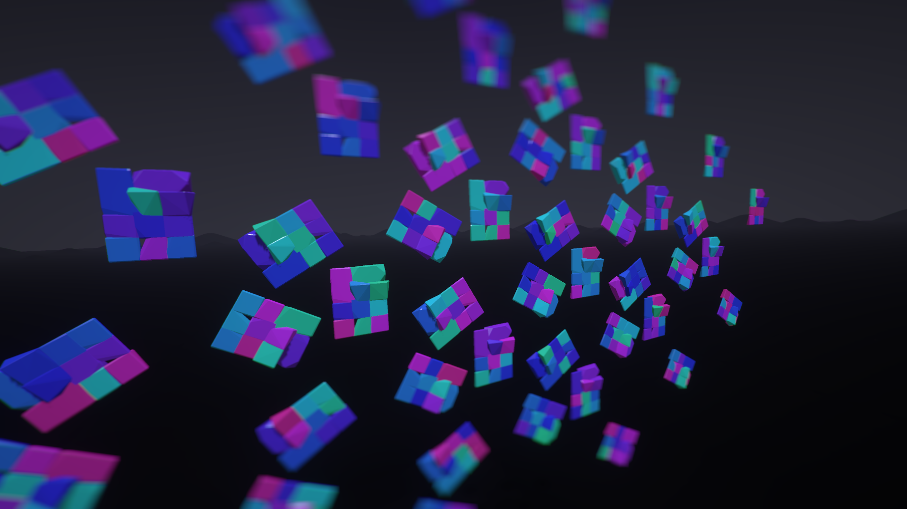
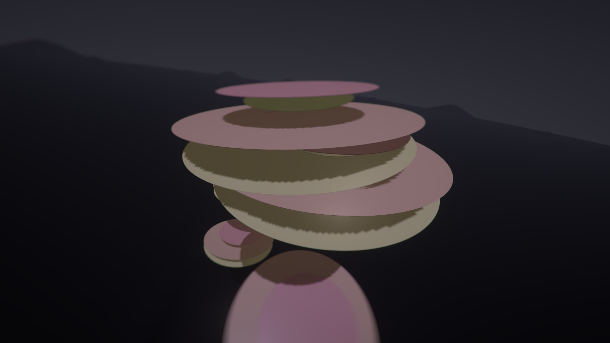
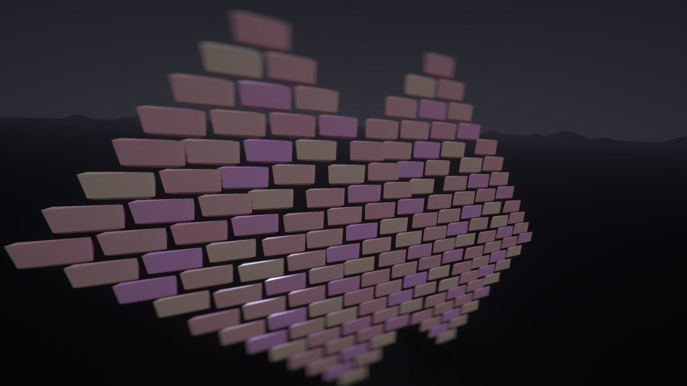
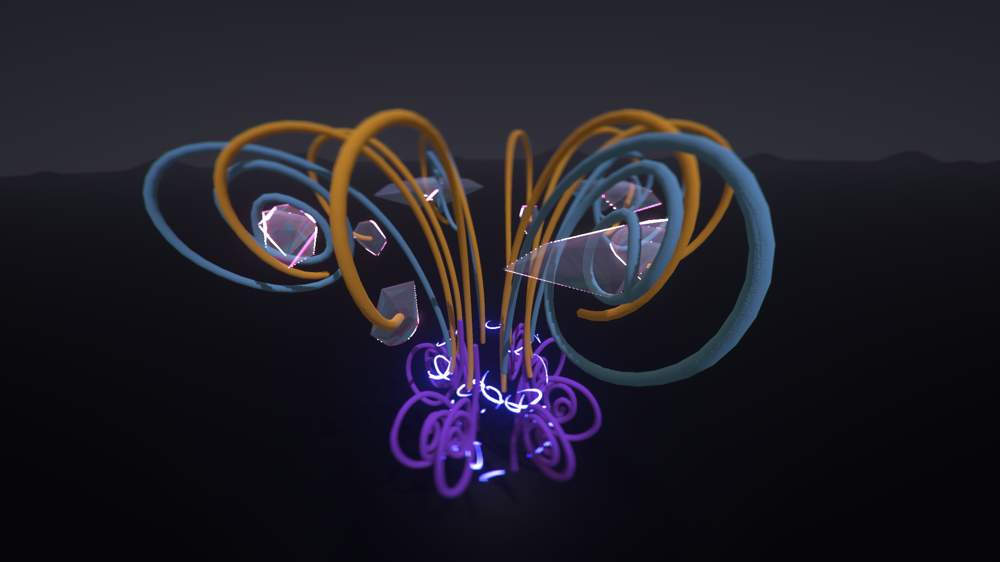
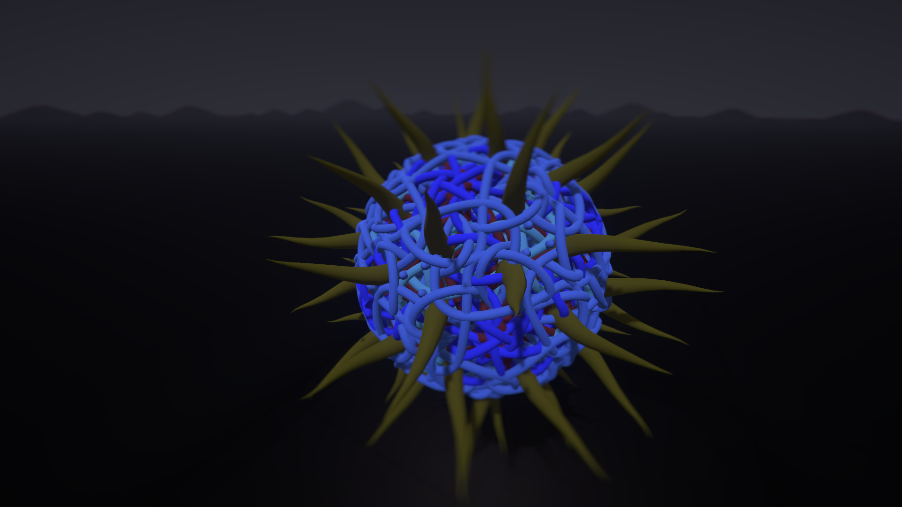

# Multi Mirror



### What does it do?

Big expansion to the mirror to support many different types of symmetry:

**Point symmetry:** Symmetry around a point. 7 families of axial symmetry plus 7 unique polyhedral symmetries.

**Wallpaper symmetry:** 17 types of tiling symmetry

**Duplicate selections using symmetry:** Create multiple clones of a selection aligned in a pattern

**Draw with multiple colours at the same time:** The colour of each stroke can be varied in interesting new ways

### What's it good for?

Creating symmetrical patterns. Drawing multiple strokes at the same time. Arranging models or images into grids or other regular patterns.

### How do I use it?

Click the button on the [Labs Panel](check-out-labs-or-experimental-features.md) to activate Multi Mirror mode:

<figure><figcaption></figcaption></figure>

When it is active you can access multi mirror settings by clicking and holding the button down for a second or so. This will bring up a panel which contains three tabs:

#### 1. Point Symmetry

<figure><figcaption></figcaption></figure>

Point symmetry creates copies arranged around the center of the mirror widget. Each icon selects one of the 14 different types of symmetry. This is the symmetry of molecules and polyhedra. It can create shapes such as stars, explosions, vases, octopi or plants and flowers.

For the first 7 point symmetry types, the slider controls how many copies are arranged around the center axis. (The other 7 types are based on tetrahedra, cubes and icosohedron and have a fixed number of copies)

#### 2. Wallpaper Symmetry

 (1) (2) (1).png>)

Wallpaper symmetry repeats your strokes in various types grid pattern - reflecting or rotating in specific ways. You can create wallpaper, floor tiles crystal lattices or any other repeating patterns.

For all symmetry types you have control over the number of copies in x and y directions. For some you can also change the scale of the grid in both the x and y directions and skew the grid cells themselves in either direction.

#### 3. Options

 (3).png>)

This screen allows you to vary the colour of each stroke based on waveforms of your choosing. Colors can cycle based on hue, saturation or brightness and the amount, frequency and type of the variance can be precisely controlled.

### Creating Patterns From Existing Brush Strokes

<figure><figcaption></figcaption></figure>

You can also create symmetrical copies from existing strokes. Simple select the strokes you want to use and duplicate them in the same way you do without the mirror (Press the secondary button on the controller you paint with)

### Creating Symmetrical Patterns from Imported Objects

<figure><figcaption></figcaption></figure>

As well as duplicating brush strokes, if you have [imported some media](using-reference-images-on-oculus-quest.md) such as images, video or 3D objects then you can select those and create copies that follow the current symmetry settings.

Be aware that there are currently no limits in place. If you create copies of complex objects or even if you create lots and lots of copies of simple objects, then Open Brush can become unresponsive or even crash.

### Known Issues

1. It's very easy to create so many strokes or duplicates of 3D models that Open Brush becomes unresponsive or even crashes. We plan to add limits and warnings once we figure out how best to calculate them.
2. A few symmetry modes move the main pointer so your main stroke is rotated somewhere else. It takes a bit of getting used to but it doesn't actually prevent you painting in these modes.

### Can I see more?


Some early experiments with spinning mirrors



Another early test of the feature


 (1).png>)  (3).png>)

 (4).png>)  (4).png>)

<figure><figcaption></figcaption></figure> <figure><figcaption></figcaption></figure> <figure><figcaption></figcaption></figure> <figure><figcaption></figcaption></figure> <figure><figcaption></figcaption></figure> <figure><figcaption></figcaption></figure> <figure><figcaption></figcaption></figure> <figure><figcaption></figcaption></figure>

