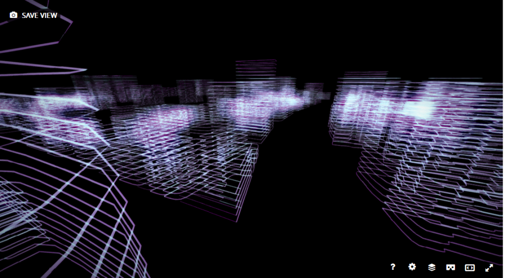
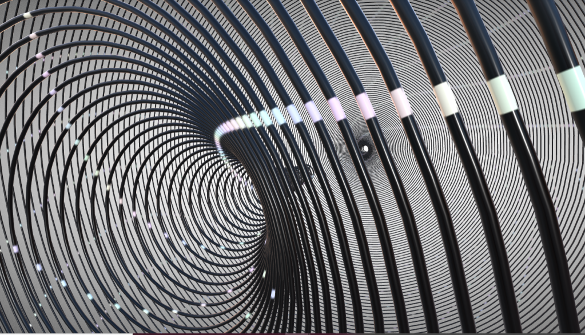

# Open Brush API

### What does it do?

[API Commands List](https://github.com/IxxyXR/open-brush/wiki/API-Commands)

Allows you to control Open Brush using commands sent from your web browser or a script you write. You can use nearly any programming language or even just type commands into your browser address bar.

It even works on computers that don't support VR. You can create Tilt Brush sketches on a Mac and export them to view in a web browser.

Example of a script that uses a web form for input:


Example output from the form shown above:



Some output from other example scripts that are included:




### What's it good for?

Almost anything! See the command list or the examples. These can be accessed via the help as described below.

You can write scripts to modify existing sketches ("change the color of all strokes to a sequence of rainbow hues"), draw entirely new ones ("draw me a landscape based on this satellite data"), automate tasks ("sign my name and export this sketch"), automatically import a directory full of 3d models and distribute them around your scene, draw fractals or complicated geometry and whatever else you can think of.

There are commands for features that are currently not exposed in the Open Brush UI such as resizing strokes and adding points to existing strokes. The example scripts should give you plenty of ideas.

### Can I run scripts automatically at startup?

Yep. All you need to do is to create a text file called "startup.sketchscript"

Make sure the file extension is .sketchscript and not .txt

Place this file in your Open Brush folder inside your user documents folder. It should go into the "Scripts" subfolder in your Open Brush folder

(Usually in C:\Users\[your user name]\Documents\Open Brush - This folder is created automatically the first time you launch the API build but you can create it yourself as well)

Each line in this file is a single command that Open Brush will run when you open it. For example:

```
load.named=startup.tilt
tool.fly
viewonly.toggle
```

This will load a sketch from your Sketch folder called "startup.tilt", switch to fly tool and turn on "viewonly" mode which disables all the panels. If you want to try this you can either rename one of your sketches to "startup.tilt" or you can change the first line in the script above. As long as the first line matches the name of a file in your Sketches folder then it should work.

If you want to distribute a sketch without people having access to the original .tilt file then you could change this slightly. Instead of loading a sketch, load an exported version of your sketch. For example, export your sketch and rename it to mysketch.glb. Place it in your Media Libary/Models folder and use this startup script:

```
import.model=mysketch.glb
tool.fly
viewonly.toggle
```

Voila - a way to let people fly around your sketches without being able to modify them.

### How do I install it?

Download a build for your headset from the link above and unzip it.

Unzip the file that's downloaded and double click on the app itself (currently named "httpapi")

To install the Quest apk use SideQuest: [https://uploadvr.com/sideloading-quest-how-to/](https://uploadvr.com/sideloading-quest-how-to/)

### How do I configure it

There are two new settings you can change in your main Open Brush.cfg Both belong in the "flags" section of the config file

Defaults:

```
"Flags": {
  "EnableApiRemoteCalls": false,
  "EnableApiCorsHeaders": false
},
```

These two settings are for security and default to "false" but you may want to set them both to "true" if you want to control Open Brush remotely.

**You should do this if you're on a private network.** Disable it or configure a firewall to restrict access to known devices if you plan to use Open Brush on public Wifi such as at an event or show. &#x20;

EnableApiRemoteCalls - by default the API only accept commands from the same machine that is running Open Brush. Set this to true to allow API commands to be sent from other computers. In most cases this will only be machines on the same local network. You will need to configure your router to accept connections on port 40074 if you want to accept commands from remote devices as well. Apps such as ngrok or localtunnel can make this simpler to set up.

EnableApiCorsHeaders: By default browsers are blocked from sending commands via javascript to another domain. Setting this to true will relax that restriction.

### How do I use Open Brush without a headset?

See [Monoscopic mode](../monoscopic-mode.md)

Monoscopic mode is a bit tricky to get the hang of but for using it as a quick way to experiment with the API then all you really need to know is how to pan the camera to look in different directions.&#x20;

Just hold down Alt (Cmd on a Mac) and drag your mouse in the viewport.&#x20;

Currently there's no controls to move the camera but we plan to add this in soon.

A few other notes on monoscopic mode:&#x20;

* Left click and drag to draw on the drawing plane (the grid shown in front of you)
* Dragging with the right button down will bring the drawing plane nearer or further.
* Ctrl+mouse will rotate the drawing plane&#x20;
* Clicking in the game window will capture your mouse cursor.&#x20;


### What's the simplest way to use the API?

Just type a command into the address bar of your browser whilst running one of the builds you've downloaded from this page.

You can also add html files to your Scripts folder. These can have standard form elements for input and some simple javascript to send commands based on those chosen values to Open Brush.

Check out the simple form examples included: [http://localhost:40074/examplescripts](http://localhost:40074/examplescripts)

### What commands are available?

Visit [http://localhost:40074/help](http://localhost:40074/help) while you've got the custom Open Brush running to access the help.

A full list of commands can be viewed by going to [http://localhost:40074/help/commands](http://localhost:40074/help/commands)

Each command has a "try it" link that will open a new browser tab with an example of the command in the address bar.

### How do I use the API from javascript

The [help](http://localhost:40074/help) has got some example scripts to look at.

Here's a simple piece of code to send a single command:

```
var xmlHttp = new XMLHttpRequest();
xmlHttp.open('GET',  '/api/v1?brush.type=ink', false);
xmlHttp.send(null);
```

### How about other languages?

Any language that can send http requests should work.

### Known Issues with the API

Currently the brush 'cursor' (or the 'turtle' if you want to think of this as a kind of LOGO system) doesn't store it's full rotation - only it's bearing.

### How to get help

With a custom build running you can visit:

```
http://localhost:40074/help
```

and follow links to useful info such as a full list of commands, examples scripts etc

