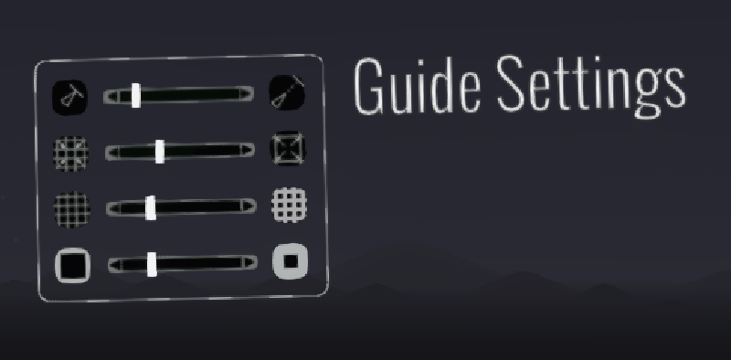

# Open Brush Unity SDK

### About 

The Open Brush Unity SDK allows you to import your Open Brush sketches into Unity. The SDK includes:

* **All** of Open Brush’s brush materials
* An importer script that automatically assigns Open Brush materials to imported .fbx, .glb .gltf files
* Open Brush’s audio reactivity functionality that make brushes react to music

### Requirements 

The SDK has these requirements:

* Your project must use Unity 2017.4.22f1 or higher

### Getting the code 

Download the latest version of the toolkit from:\
[github.com/googlevr/tilt-brush-toolkit/releases](https://github.com/googlevr/tilt-brush-toolkit/releases)

The SDK comes in the form of a Unity Package. To import:

1. Open Unity
2. Create a project or open an existing one
3. Double click the downloaded .unitypackage file, or go to Assets > Import Package > Custom Package.
4. Import the package

### Importing a sketch 

To use a Tilt Brush sketch inside of Unity, you need to **export it** and copy the exported .gltf file into your project. You do _not _need any of the .png files that come with the export. The SDK will use its own, Tilt Brush materials instead.

The SDK will process .gltf files on import and assign the correct materials.

**Note**: the Oculus Quest version of Tilt Brush cannot write .fbx files.&#x20;

To export a sketch:

1. Open Tilt Brush, load your sketch
2. Click the **\[...]** icon in the settings area of your hand menu
3. Click the **Labs **icon
4. Hit **Export** in the floating window that pops up

To import a sketch into your scene:

1. Copy the .fbx file (in My Documents/Open Brush/Exports on Windows or Documents/Tilt Brush/Exports in Mac) into your Unity project
2. Drag the file from the Project window into the Hierarchy

_Notes:_

* _The Open Brush Unity SDK doesn’t load .tilt files._
* _You don’t need to copy the textures included with the .fbx into your project_

### Linear vs Gamma 

The v11 toolkit shaders support both sRGB (Gamma) and Linear [color spaces](https://docs.unity3d.com/Manual/LinearRendering-LinearOrGammaWorkflow.html). The shaders are set to Gamma mode by default. **If you wish to use Linear, add this call somewhere in your program**.

Shader.EnableKeyword("TBT\_LINEAR\_TARGET");

### Tips 

#### Audio Reactivity 

You can make the brushes wiggle to the audio in your scene:

1. Drag the** \[Tilt Brush Audio Reactivity] prefab** into your scene
2. Add an audio source to your scene, if there’s none

If the brushes aren’t moving, you can select the prefab in Play mode to visualize the audio data the shaders are receiving:

#### Bloom 

\
You can achieve_ an Open Brush look_ by adding **Bloom**, using Unity’s built-in shaders:

1. Import the Standard Assets “Effects” package (Assets menu / Import Package / Effects)
2. **Important: **Enable your camera’s HDR checkbox\
   
3. Add the Bloom post-processing effect, these are recommended settings:\
   

Internally, Open Brush uses a modified version of Sonic Ether bloom, which has been released as [open source](https://github.com/sonicether/SE-Natural-Bloom-Dirty-Lens).
