# Example Pointer Plugins

### Dashes

Stops and restarts the stroke at regular intervals as you draw resulting in a dashed line.

#### Parameters

* **Frequency:** How many dashes there are in a given distance. Shorter values gives a result closer to a dotted line.
* **Spacing:** Controls the spacing between dashes

#### Tips

If you use this in conjunction with [Lazy Input Mode](../../lazy-input.md) then you'll need to draw very slowly on the default settings Dashes.

#### How it works

The script calls`Brush:ForcePaintingOn` and `Brush:ForcePaintingOn` based on the value of `Brush:DistanceDrawn`

### GridFollow

<figure>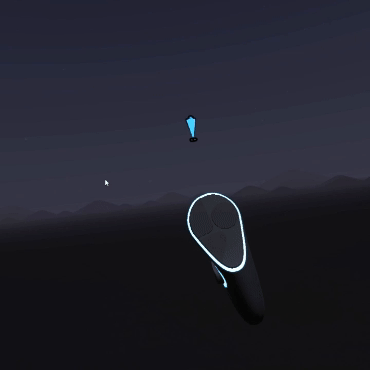<figcaption></figcaption></figure>

Locks movement of the pointer to either the x, y or z axis depending on which direction your hand is mostly moving.

#### Parameters

* **Speed:** How fast the pointer can move as it tries to keep up with your hand movements
* **Frames Between Changes:** To avoid creating weird unintended artifacts, the plugin ignores changes of direction that happen too soon after the last one. You can control how many frames a direction is "locked in" here.

#### Tips

Draw slowly and deliberately. It can be tricky to get the hang of initially.

### LaserBeam

<figure>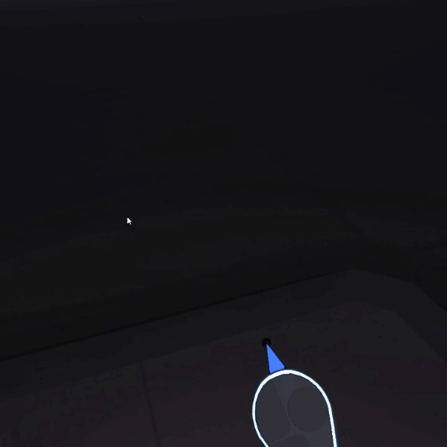<figcaption></figcaption></figure>

The pointer continues moving in the direction you were pointing when you initially pressed the trigger. Pew pew...

#### Parameters

* **Speed:** The speed of the beam

#### Tips

You definitely want to try this in conjunction with Symmetry Plugins - especially if you also spin the mirror widget.

### Loops

<figure>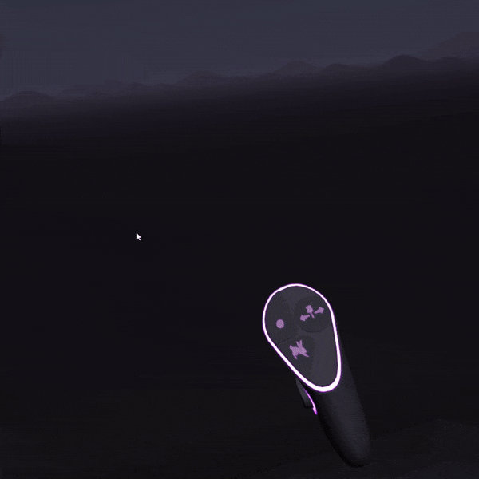<figcaption></figcaption></figure>

The pointer moves around a circlular path with your current hand position as it's center.

#### Parameters

* **Speed:** The speed of the pointer
* **Radius:** The size of the circle it moves around

### Ballistic Missile

<figure><figcaption></figcaption></figure>

Similar to \[LaserBeam]\(example-pointer-plugins.md#laserbeam) except that you can steer the brush stroke as it moves.

#### Parameters

* **Speed:** The speed of the missile

### Oscilloscope

Control your pointer with multiple waveforms to create patterns

#### Parameters

* **X Waveform Type:** The waveform used along the x axis
* **X Frequency:** The frequency for the x axis waveform
* **Y Waveform Type:** The waveform used along the y axis
* **Y Frequency:** The frequency for the y axis waveform
* **Y Phase:** The phase of the y waveform relative to x
* **Radius:** A scaling factor applied to both axes

**Tips**

The values for waveform type are as follows:

* 0=Linear
* 1=Cosine
* 2=Triangle
* 3=Sawtooth
* 4=Square
* 5=Pulse(0.8)
* 6=Pulse(0.2)
* 7=Exponent
* 8=Power(2)
* 9=Power(0.5)
* 10=Parabolic
* 11=Exponential Sawtooth
* 12=Perlin Noise
* 13=White Noise
* 14=Brown Noise
* 15=Blue Noise

### PolygonBrush

<figure>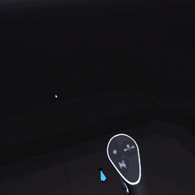<figcaption></figcaption></figure>

The brush draws a path around your current hand position similar to \[Loops]\(example-pointer-plugins.md#loops) - except the path is a polygon instead of a circle.

#### Parameters

* **Points:** How many sides the polygon has
* **Size:** The outer radius of the polygon

### RainbowStrokes

<figure>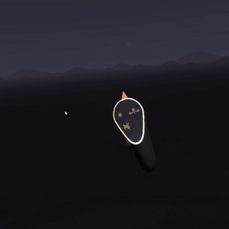<figcaption></figcaption></figure>

At regular intervals, ends a stroke and starts a new one with a different color. The effect is similar to dashes but with the smallest possible gap between sections of the stroke.

#### Parameters

* **Rate:** The number of frames between color changes.
* **Hue Shift Frequency:** How fast to cycle the hue
* **Hue Shift Amount:** How much the hue changes

### SineWave

<figure>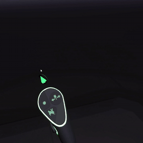<figcaption></figcaption></figure>

Moves the pointer in a simple wave pattern as you draw.

#### Parameters

* **Frequency:** How close together the peaks of the waveform are
* **Amplitude:** The height of the waveform

### Spherograph

<figure>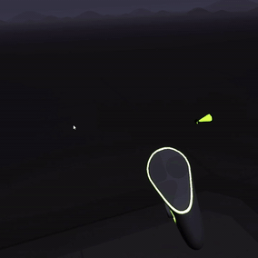<figcaption></figcaption></figure>

Creates spherical patterns around the initial point you start drawing. The distance you move affects the patterns progress but the position is always centered around the initial point.

#### Parameters

* **U Scaling:** The rate of change of the pattern horizontally around the sphere
* **V Scaling:** The rate of change vertically around the sphere
* **Radius:** The size of the sphere

### Spirals

<figure>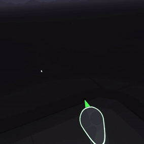<figcaption></figcaption></figure>

The brush stroke moves in a circle but the radius increases the longer you keep the trigger pressed.

#### Parameters

* **Speed:** Controls the tightness of the spiral via changing the rate at which the pointer rotates around the brush position
* **Radius:** The overall size of the spiral

### Spirograph

Draw a spirograph pattern as you move your brush. Ignores your hand position and simply uses the distance you've moved.

### StringArt

<figure>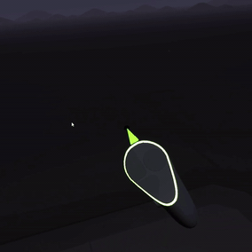<figcaption></figcaption></figure>

Additional lines are drawn from the initial point you started drawing to your current brush position.

#### Parameters

* **Rate:** How many frames to wait before drawing another connecting line

### Terrain

<figure><figcaption></figcaption></figure>

As you draw you only control the x and z position of the stroke. The y position (the height) is determined by a noise function that maps out hills and valleys.

#### Parameters

* **Scale:** The scale of the terrain. Larger values spread out hills and valleys more, smaller values make them smaller
* **Height:** The height of the terrain. (Scales everything in the vertical direction)
* **Offset:** The starting distance of the terrain off the floor

#### Tips

If you want to use a hull brush then draw small patches or else any valleys will be filled in. For hull style results you will probably be better off using the [low poly landscape Tool Plugin](example-tool-plugins.md#lowpolylandscape)

### Twist

<figure>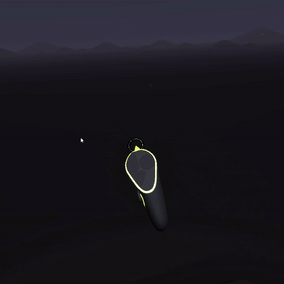<figcaption></figcaption></figure>

As you draw the position is controlled by your hand as normal. However the orientation of the stroke spins around by itself

#### Parameters

* **Speed:** How fast to spin around the axis

#### Tips

* Try this with a broad flat brush like Paper or a brush that has an interesting profile shape such as Faceted Tube
* This spins around the z-axis. i.e. the direction your brush is pointing. You will only see an effect of you draw strokes forwards or backwards along this axis.

### WandLerp

<figure>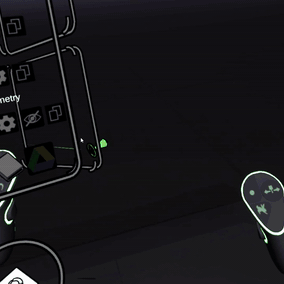<figcaption></figcaption></figure>

The brush position cycles back and forth between your brush hand and your other hand. Paint with both hands for a change...

#### Parameters

* **Frequency:** The speed to oscillate between the brush and the wand
* **Amplitude:** Controls how much to move. 0 is just the midpoint between both hands, 1 will reach both hands, 2 will overshoot both hands

#### Tips

Move your hands close together or further apart to see different effects

### Wander

<figure>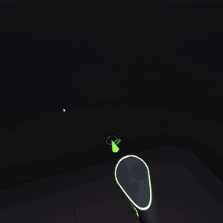<figcaption></figcaption></figure>

The brush stroke wanders off in random directions while you hold the trigger

#### Parameters

* **Speed:** How fast the pointer should move
* **Frames Per Path:** After this many frames, the stroke is restarted from the current brush position

### Wiggle

<figure>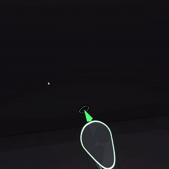<figcaption></figcaption></figure>

Randomizes the brush position

#### Parameters

* **Wiggle Amount:** The amount of randomness to add to the brush position

### Wobble

<figure>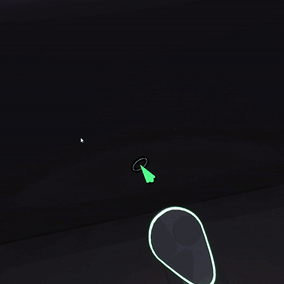<figcaption></figcaption></figure>

Like Wiggle but uses a smooth noise function

#### Parameters

* **Position Amount:** The amount the noise affects the brush position
* **Rotation Amount:** The amount the noise affects the brush orientation
* **Frequency:** The scale of the noise function (higher = more jagged)
