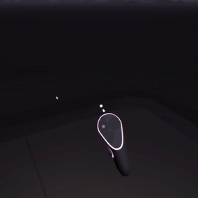
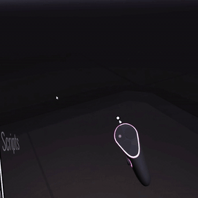
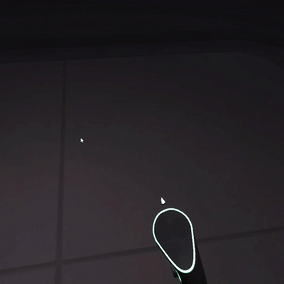
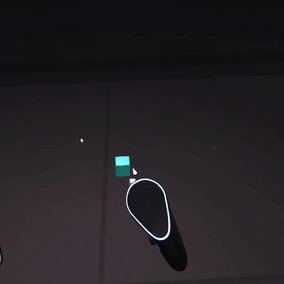
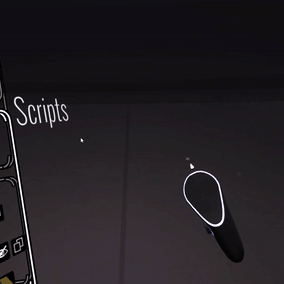
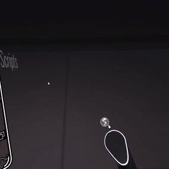
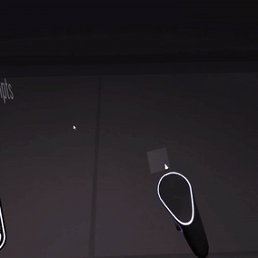
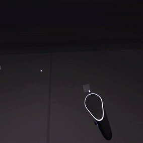
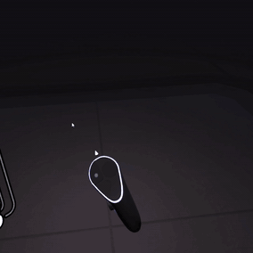
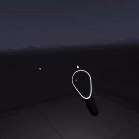

# Example Tool Plugins

### Circle

<figure><figcaption></figcaption></figure>

Draws a circle centered on the position you first press the trigger with the radius and orientation controlled by where you release the trigger.

### CircularPath



Similar to [Circle ](example-tool-plugins.md#circle)except it creates a camera path instead of a brush stroke

#### Parameters

* **Sides:** The circle is approximated by a polygon. This controls the number of sides.

### Cube

<figure><figcaption></figcaption></figure>

Draws a cube centered on the position you first press the trigger with the size and orientation controlled by where you release the trigger.

#### Parameters

* **Point Spacing:** The distance between control points for the strokes that make up the cube
* **Inset Amount:** How much to inset each face towards it's center

### LowPolyLandscape



Draws tiles that follow a hilly landscape as you hold the trigger.

#### Parameters

* **Scale:** The scale of the landscape. Smaller values make hills and valleys closer together
* **Height:** The height of the landscape (Controls the vertical scaling)
* **Offset:** The distance from the floor to position the landscape
* **Grid Size:** The size of the grid used. Bigger values are more "low poly"

### RandomAvatar



Calls an API to generate a random SVG icon using the [MultiAvatar ](https://multiavatar.com/)library

### RandomIcon

Calls an API to generate a random SVG icon using the [Iconify ](https://iconify.design/docs/api/)library

### Rays

<figure><figcaption></figcaption></figure>

Draws lines from the position you start drawing to your current position.

#### Parameters

* **Spacing:** How often to draw a new stroke

### ~~ReplayStroke~~

_(Currently removed while I fix a bug)_

Instantly draws a brush stroke based on the path of the last brush stroke you drew

### ScatterCubes

<figure><figcaption></figcaption></figure>

Switches to the Hull Brush and draws cubes of random size and color as you move your brush",

#### Parameters

* **Maximum Size:** Controls how big the cubes can be
* **Spread:** Larger values allow cubes to be placed further from your brush position
* **Amount:** 0.5 gives a random 50/50 chance of creating a new cube each frame. Smaller values produce less cubes, larger values more.

### Spiral

<figure><figcaption></figcaption></figure>

Draws a conical spiral.

#### Parameters

* **Number of turns:**
* **Number of steps per turn:**

### SpiralSphere

<figure><figcaption></figcaption></figure>

Draws a spherical spiral.

#### Parameters

* **Steps:**
* **Turns:**

### SuperFormula

<figure><figcaption></figcaption></figure>

Draws a supershape using the [Super Formula](http://paulbourke.net/geometry/supershape/)

#### Parameters

* **Symmetry:**
* **n1:**
* **n2:**
* **n3:**

### SvgHeart

<figure><figcaption></figcaption></figure>

Draws a heart shape using an [SVG Path](https://developer.mozilla.org/en-US/docs/Web/SVG/Tutorial/Paths)

#### Parameters

* **Point Spacing:**

### VoxelLandscape

<figure><figcaption></figcaption></figure>

Draws a blocky landscape (best used with a hull brush).

#### Parameters

* **Horizontal Spacing:**
* **Verticle Spacing:**

### Voxels

Draws regular blocks in space as you draw (best used with the hull brush)

<figure><figcaption></figcaption></figure>

#### Parameters

* **Grid Size:**

### Words



Draws words that follows your brush. Tries to access the clipboard so try copying in some text.

#### Parameters

* **Size:**
* **Spacing:**
