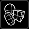

# Using the Open Brush Tools, Quick Tools, and Menu panels

On your Open Brush panels, you’ll see a number of different options and features. Learn more about them below.

**Eraser, Dropper, Re-Color, Camera, Teleport, Selection, Mirror,** and **Straight Edge** are all on the top level of the Tools panel. on the "More..." panel, which is originally below the Tools panel, you can access **Environment, Lights, Backdrop, Guides, and Poly Library**.

At the bottom of the palette is the Menu panel which opens when you hover over it. In both Beginner and Advanced Mode, this Menu panel contains the **Sketchbook, My Profile, Beginner/Advanced Mode, Clear Sketch, Save Sketch, and Upload**. When you are in Advanced Mode, the "**More Options...**" button will also appear within the Menu panel and contains the **Tips 'N Tricks, Labs, and Settings.**

Additionally, you can find the **Brush, Dropper, re-color, Selection, Model Pin, and Eraser** on the Quick Tools panel. The Quick Tools panel is accessed:

* HTC Vive: From the Menu Button on top of the thumbpad.
* Oculus Rift: From the B button \(right handed\).
* Windows Mixed Reality: From the Menu button, in between the thumbpad and thumbstick

###  **Environments**

You can choose a number of different virtual environments to paint in. For example, you can paint in Studio, Night Sky, Space or on a Dress Form. The lighting in the environment will affect the color of the brush stroke, but switching environments will not affect your existing brush strokes.

###  **Dropper**

To select the brush and color used for a stroke or the color in a reference image:

1. Position your controller on the brush stroke or the color in an image you want.
2. Press the trigger to confirm.
3. Your brush type, color and size will be copied.
4. To disable the brush picker, select the icon again.

###  **Eraser**

You can use the eraser tool to erase entire brush strokes. To select the tool:

1. Point your painting controller towards the palette and select the eraser .
2. Position the tool anywhere on the brush stroke and press the trigger to erase.
3. To disable the eraser, select the icon again.

Note: To erase your last brush stroke quickly, you can also use Undo. To use Undo, press the left side of the palette controller’s disk. You can also use Undo if you accidentally erase a brush stroke.

###  **Teleport**

To virtually hop to a different spot in your environment, use Teleport.

1. Point your painting controller towards the palette and select Teleport.
2. On your painting hand, press the thumbpad or trigger to move around the x and y axis.
3. You will see footprints on the ground, which represent your landing spot.
4. To disable Teleport, select the icon again.

Note: The distance which you can teleport varies in each environment.

###  **Undo & Redo**

#### **Undo** 

To Undo your last brush stroke or action, you can select Undo. To select Undo on your palette:

1. Point your tool towards the palette and select Undo .
2. You can select Undo once to erase your last brush stroke, or multiple times to Undo multiple brush strokes.

Note: There is an Undo shortcut on the left side of the palette controller’s disk. Press down to Undo.

#### **Redo** 

To Redo an erased or undone action, you can select Redo. To select Redo on your palette:

1. Point your tool towards the palette and select Redo .
2. You can select Redo once to restore your last brush stroke, or multiple times to restore multiple brush strokes.

Note: There is a Redo shortcut on the right side of the palette controller’s disk. Press down to Redo.

###  **Mirror Tools**

#### **Mirror** 

Use the mirror mode tool to paint symmetrically. To use the tool:

1. Point your painting controller towards the palette and select Mirror Mode.
2. To grab and move the mirror, use the Grip button on the sides of your controllers.
3. To adjust the mirror back to default, grab and move the mirror onto the snapback widget.
4. To spin the mirror, grab the mirror using the Grip button on the right side of your painting controller. Throw the mirror to spin it in an infinite loop. You can then paint within this loop.

#### **Recall Mirror** 

To recall a Mirror that is out of reach, long press on the Mirror button on the Tools panel and the Recall Mirror button will appear.

###  **Straight Edge**

Use the straight edge tool to paint in straight lines between two points.

###  **Cameras**

Use Cameras to save your creation in various formats.

1. Point your painting controller towards the palette and select Cameras.
2. On your painting controller, swipe the thumbpad \(HTC Vive\) or thumbstick \(Oculus Rift and Windows Mixed Reality\) right or left to access the Camera options.
3. After selecting your option, your image file will save to the Documents folder on your computer.
4. You can then share photos, videos, and GIFs or your artwork online.

Note: Using Cameras will not save your sketch to the Sketchbook.

###  **Recolor**

To change the color of a stroke:

1. Choose the color you want to use in the color palette
2. Position your controller on the brush stroke you want to change.
3. Press the trigger.
4. Your stroke's color will be changed.
5. To disable the brush picker, select the icon again.

###  **Selection Tools**

#### **Select** 

Use Selection to select and duplicate strokes and models in your scene.

1. Select strokes using the trigger. You can also flip into deselect mode by tapping the thumbpad \(HTC Vive and Windows Mixed Reality\) or “A/X” button \(Oculus Rift\).
2. If you want to move your selection, grab it as you would any other model in your scene. To delete a selected group of strokes, just throw it away.
3. Duplicate selections by holding the thumbpad \(HTC Vive and Windows Mixed Reality\) or “A/X” button \(Oculus Rift\) while intersecting your controller with selected strokes.

#### **Select All** 

To select everything in a scene, long press on the Select button on the Tools panel and the Select All button will appear.

#### **Invert Selection** 

To invert a selection that you have just made, long press on the Select button on the Tools panel and the Invert Selection button will appear.

###  **Model Pin**

Pin models, images, or guides in a scene using the Model pin.

###  **Backdrop**

Use Backdrop to modify your scene's backdrop color gradient and fog.

* Grab anywhere on the backdrop sphere to move or turn it by selecting with the trigger
* The backdrop sphere represents the sky dome \(skybox\) in the world.
* Change the backdrop gradient by selecting different colors.
* Change the fog intensity by adjusting the slider, and you can change the color by clicking on the fog rectangle.
* Reset your environment at any time by reloading it from the environment panel.
* Custom environments save with sketches
* Some environments already have textured sky dome. In that case, you will be prompted to turn off that custom skybox before you can modify it.

###  **Poly**

Poly was shut down on June 30, 2021. This feature will soon be replaced by an equivalent that uses [Icosa](https://beta.icosa.gallery/)

~~Use the Poly panel to import remixable \(CC-BY\) objects and Blocks models uploaded to~~ [~~Poly~~](https://poly.google.com/)~~.~~

* ~~Any CC-BY Blocks model or .obj you like on Poly will appear on that panel \(assuming you are signed-in with the same account\).~~
* ~~Featured Poly creations will also be accessible on the panel, whether you are signed-in or not.~~
* ~~You can remix Blocks models and uploaded .objs in your Open Brush sketches, and share remixed sketches back to Poly.~~
* ~~Note: you cannot import published Open Brush sketches into Open Brush sketches at this time.~~

###  **Lights**

Use Lights to modify your scene's primary and secondary lighting colors and positioning.

* The sun is your primary light, and it casts shadows.
* The sun is the brighter light.
* The moon is your secondary light, it doesn’t cast shadows.
* The fill light floods the scene with an equal distribution of color and light. It's effects are most easily seen in the shadow color of your scene.
* You can grab and move the sun and moon by selecting with the trigger.
* You can change the color of all three light sources.
* The lighting effect is best observed on environments with a ground and object \(i.e. pedestal\), and in those sketches where there are at least a few strokes.
* The sphere the lights pivot around can be used as a representation/quick preview for placement of lights in the world.
* Custom lights save with sketches.

###  **Guides**

* Use the sphere, cube, and pill guides to create perfect shapes.
* Guides are moved and scaled similar to other widgets, using the Grip buttons.
* You can pin Guides in your scene, as you can models.

\*\*\*\*

\*\*\*\*

