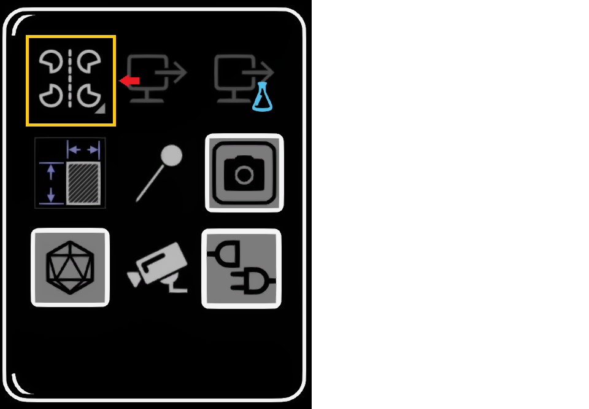

# The Open Brush UI

On your Open Brush panels, you’ll see a number of different options and features. Learn more about them in the pages that follow.

**Eraser, Dropper, Re-Color, Camera, Teleport, Selection, Mirror,** and **Straight Edge** are all on the top level of the Tools panel. on the "More..." panel, which is originally below the Tools panel, you can access **Environment, Lights, Backdrop, Guides, and Poly Library**.

At the bottom of the palette is the Menu panel which opens when you hover over it. In both Beginner and Advanced Mode, this Menu panel contains the **Sketchbook, My Profile, Beginner/Advanced Mode, Clear Sketch, Save Sketch, and Upload**. When you are in Advanced Mode, the "**More Options...**" button will also appear within the Menu panel and contains the **Tips 'N Tricks, Labs, and Settings.**

### **The Quick Tools Panel**

Additionally, you can find the **Brush, Dropper, re-color, Selection, Model Pin, and Eraser** on the Quick Tools panel.

<figure><figcaption></figcaption></figure>

The Quick Tools panel is accessed:

* Most devices (eg Quest, Rift, Pico, Vive XR): From the B button if you're right handed (or more generally the secondary button on your painting hand).
* HTC Vive: From the Menu Button on top of the thumbpad.
* Windows Mixed Reality: From the Menu button, in between the thumbpad and thumbstick
