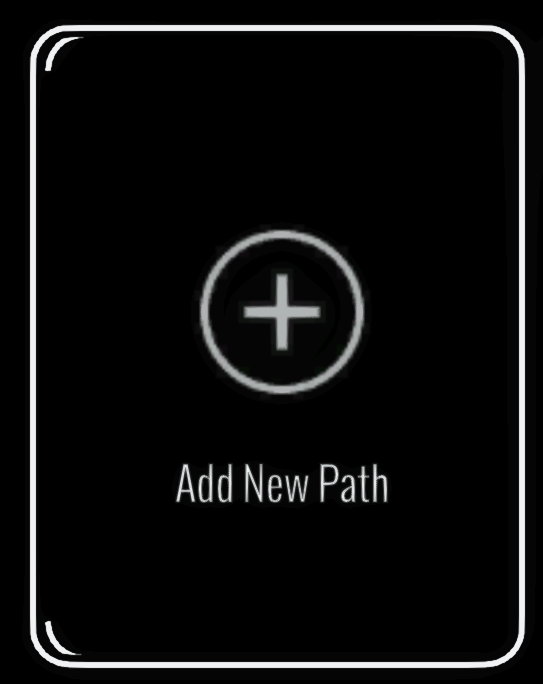

# Camera Paths Panel

<figure><figcaption></figcaption></figure>

The Camera Paths panel lets you create a path by placing anchor points, recording a flight or drawing a route through the scene. After creating a path, use this panel to select it and edit its direction, speed and field of view before recording.

See the [Camera Paths Tool](../../exporting-videos/camera-paths-tool.md) guide for all creation methods and controls.
