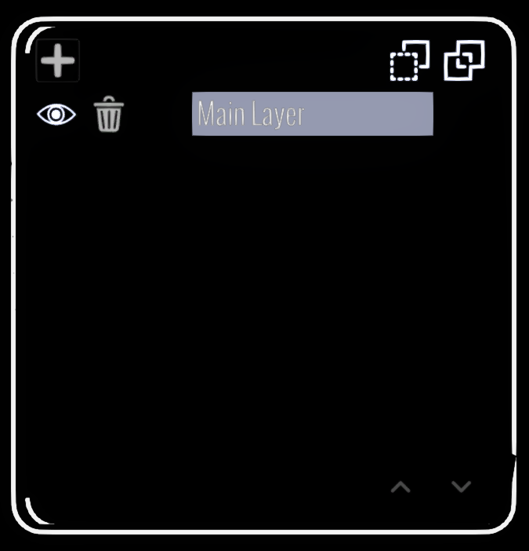

# Layers Panel

<figure><figcaption></figcaption></figure>

The Layers panel organizes a sketch into separate layers. New strokes and imported media are added to the active layer.

## Add and activate layers

1. Select **Add Layer** to create a layer and make it active.
2. Select an existing layer to make that layer active.
3. Use the visibility control beside a layer to show or hide it.

Hidden layers remain part of the sketch but are omitted from exports. This is useful for construction lines, guides or alternate versions that you do not want in an exported model.

## Clear, delete or combine layers

The layer controls can clear the contents of a layer, delete a layer, or squash it into another layer. Squashing moves the source layer's strokes and media into the destination layer and removes the source layer. These actions can be undone.

Use [Move Selection to Current Layer](../tools-panel/selection-options.md#move-selection-to-layer) when you only want to move or copy selected items rather than combining an entire layer.

## Browse additional layers

The panel displays one page of layers at a time. When the sketch contains more layers than fit on the panel, use the previous and next page buttons to move through them. Selecting an active layer on another page automatically opens the page containing that layer.

Adding layers is not limited by the number of layer buttons visible on one page.

## Name layers

Select a layer name to rename it with the [XR Keyboard](../../xr-keyboard.md).
