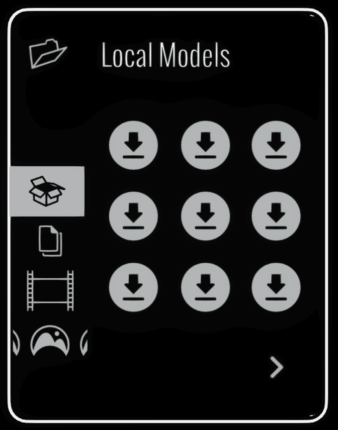

# Media Library

<figure><figcaption></figcaption></figure>

The Local Media Library is opened from the Extras panel. Its tabs provide access to media stored on the device:

1. **Local Images** places reference images in the sketch.
2. **Local Videos** places video widgets in the sketch.
3. **Local Models** places imported 3D models.
4. **Background Images** replaces the environment sky with a panoramic image.
5. **Saved Strokes** loads reusable groups of editable brush strokes.

Use the path, **Up** and **Home** controls to [browse folders and subfolders](../../folder-navigation.md). Use the page arrows when the current folder contains more files than fit on one page.

See [Importing Images, Videos and 3D Models](../../importing-images-videos-3d-models.md) for supported formats and file locations.
