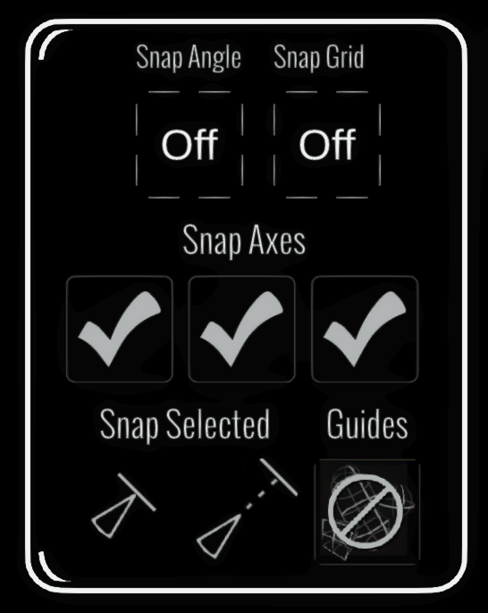

# Snap Settings Panel

<figure><figcaption></figcaption></figure>

The Snap Settings Panel provides controls for grid and angle snapping. For basic usage, see [Grid and Angle Snapping](../../grid-and-angle-snapping.md).

## Enhanced Snap Settings

The snap settings include several advanced features:

### Snap Axis Toggles

Position snapping and rotation snapping each have separate **X**, **Y** and **Z** toggles. Disabling an axis leaves that position or rotation component unsnapped. For example:

* Enable only Y-axis snapping to keep strokes at consistent heights while allowing free movement in X and Z
* Enable only X and Z to create a flat plane of snapped objects
* Enable all three axes for full 3D grid snapping

This is useful for creating rows, columns, or planes of duplicated objects while maintaining precise control over which dimensions are constrained.

Use the position-axis buttons with the grid interval and the rotation-axis buttons with the angle interval. Axis snapping is different from the [Transform Panel's axis locks](transform-panel.md): snapping rounds movement or rotation to increments, while a lock prevents that component from changing.

### Snap to Guides

When you have guides active in your scene, you can enable snapping to align selections and brush strokes to guide surfaces. This works with:

* Plane guides
* Sphere guides
* Line guides
* Mirror planes

This makes it easier to paint directly on guide surfaces or position imported models precisely on guides.
