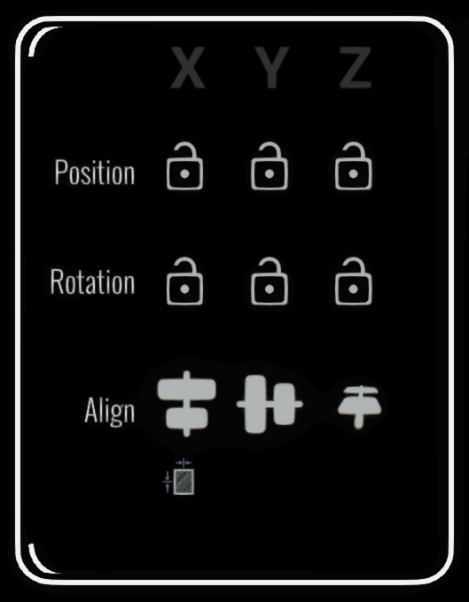

# Transform Panel

<figure><figcaption></figcaption></figure>

The Transform panel controls how a selection can move and rotate. Its axis locks work with selected brush strokes, imported media and guides.

## Enter exact transforms

The position, rotation and scale fields show the current selection transform. Select a value to open the numeric keyboard, enter a replacement and confirm it. If no selection is active, the fields apply to the last media or guide widget you moved.

## Position locks

Use the **X**, **Y** and **Z Position Lock** buttons to prevent movement along individual sketch axes. For example, lock Y to move an object across a level plane without changing its height. Lock two position axes to constrain movement to a straight line.

## Rotation locks

Use the **X**, **Y** and **Z Rotation Lock** buttons to prevent rotation around individual sketch axes. The unlocked axes remain free to rotate.

Axis locks retain the object's existing position or rotation on the locked axes. They use the sketch's coordinate system, so rotating the whole sketch also changes how those axes relate to the room.

Axis locking is different from snapping: locks prevent a value from changing, while snapping moves it to fixed increments. See [Snap Settings](snap-settings-panel.md).

## Align selected items

Select two or more strokes or widgets, choose whether their minimum edges, centres or maximum edges should line up, then select **Align X**, **Align Y** or **Align Z**. Open Brush moves the items to a common line or plane on that axis. The action can be undone.

## Distribute selected items

The distribution controls spread selected items along X, Y or Z. Choose minimum edges, centres, maximum edges or equal gaps as the spacing reference, then select the axis. Use at least three selected items so Open Brush has endpoints and an item to distribute between them.
