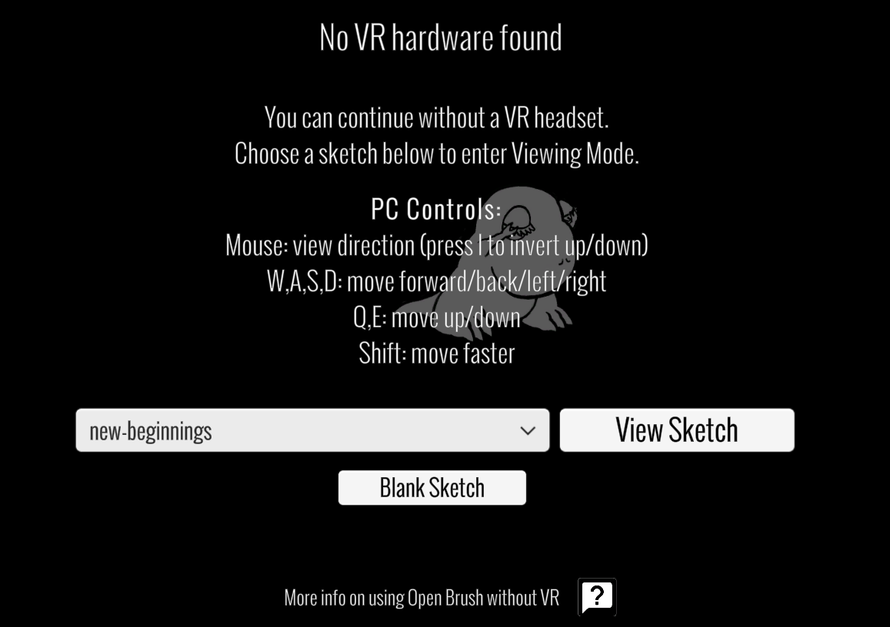

# View-only Mode

View-only mode lets people browse and explore Open Brush sketches without showing the painting and editing tools. It works in both VR and non-VR: the mode controls what someone can do in Open Brush, while XR settings control how Open Brush is displayed and controlled.


View-only mode is a presentation mode, not a security feature. It does not encrypt or remove the underlying sketch files, and it can be changed at runtime through Open Brush's scripting interfaces.


<figure><figcaption></figcaption></figure>

## What changes in View-only mode

When View-only mode is active, Open Brush:

1. Replaces the painting and editing panels with the View-only interface.
2. Keeps the Sketchbook available for browsing local and Icosa Gallery sketches.
3. Limits movement tools to Fly and Teleport.
4. Hides the painting pointer and other editing controls.
5. Keeps View-only mode active when another sketch is loaded.

This makes it suitable for exhibitions, demonstrations, shared headsets and dedicated sketch-viewer installations. For restricting an individual participant inside a multiplayer room, see [Manage a room](multiplayer.md#manage-a-room); multiplayer permissions are separate from the application-wide View-only mode.

## Start Open Brush in View-only mode

### Start from Steam

The simplest way to enter View-only mode on a computer is to use the launch mode provided by Steam:

1. Select **Play** for Open Brush in Steam.
2. Choose **View-only Mode** from the list of launch modes.
3. Select **Play** again to start Open Brush.

This starts the regular Steam installation with painting and editing tools hidden. No command-line or config-file changes are required.

### Use a dedicated viewer build

Dedicated viewer builds start in View-only mode automatically.

### Use the command line

With a regular desktop build, add `--ForceViewOnly` when launching Open Brush:

```text
OpenBrush.exe --ForceViewOnly
```

`--ForceViewOnly` does not disable XR. If a headset is active, Open Brush remains in VR and presents the restricted viewer interface.

To open the flat-screen viewer even when XR hardware is available, combine it with `--DisableXrMode`:

```text
OpenBrush.exe --ForceViewOnly --DisableXrMode
```

See [Command Line Arguments](command-line-arguments.md) for general launch syntax.

### Make View-only mode persistent

Set `ForceViewOnly` in the `Flags` section of `Open Brush.cfg` to start in View-only mode on every launch:

```json
{
  "Flags": {
    "ForceViewOnly": true
  }
}
```

Add `"DisableXrMode": true` to the same section if the persistent setup should use a flat screen instead of XR. See [The Open Brush config file](the-open-brush-config-file.md) for the file location and formatting rules.

## Browse and open sketches

Open the Sketchbook to browse a thumbnail grid. **Local Sketches** contains work saved on the device. The other available tabs contain sketches from the Icosa Gallery, including curated work and, when signed in, sketches you have liked.

Select a thumbnail to load that sketch. View-only restrictions remain active after it loads.

## Navigate in VR

Use the View-only Admin panel to choose between the Fly and Teleport tools. These navigation tools work as they do in the regular painting interface, but the drawing and editing tools remain hidden.

## Navigate on a computer

1. Drag with the mouse to look around.
2. Use **W**, **A**, **S** and **D** to move forward, left, backward and right.
3. Use **Q** and **E** to move down and up.
4. Hold **Shift** to move faster.
5. Press **I** to invert the vertical look direction.

Standard gamepads can also be used to navigate.

## Navigate on a touchscreen

1. Drag on the scene to look around.
2. Use the on-screen joystick to move horizontally.
3. Use the up and down buttons to move vertically.
4. Use the Sketchbook button to choose another sketch.

## Control View-only mode from a script

The [HTTP API](open-brush-api/) command `viewonly.toggle` switches View-only mode on or off.

Lua plugins can set the state explicitly:

```lua
App:ViewOnly(true)
App:ViewOnly(false)
```

See [Writing Plugins](using-plugins/writing-plugins/) for information about Lua plugins. Runtime commands change the interface mode; they do not enable or disable XR.

## View-only Mode, non-XR and Monoscopic Mode

These settings affect different parts of Open Brush:

| Setting or mode | Editing tools | XR |
| --- | --- | --- |
| View-only mode | Hidden | Can remain enabled or be disabled separately |
| `DisableXrMode` | View-only fallback unless Monoscopic Mode is enabled | Disabled |
| [Monoscopic Mode](monoscopic-mode.md) | Available | Disabled |

Use `ForceViewOnly` when the important requirement is preventing normal editing through the interface. Use `DisableXrMode` when the important requirement is running without XR; Open Brush then uses the flat-screen viewer unless Monoscopic Mode is enabled. Use both `ForceViewOnly` and `DisableXrMode` for a dedicated flat-screen viewer that always starts with editing controls hidden.
